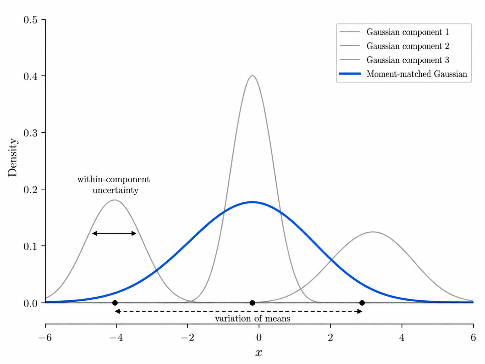
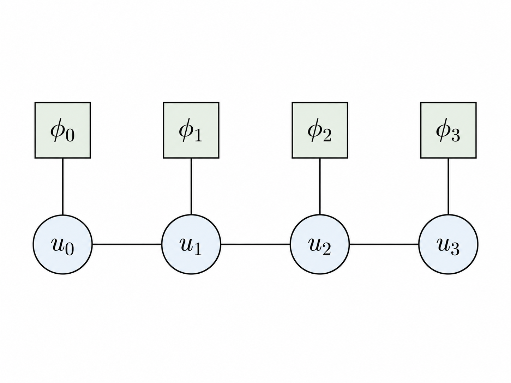
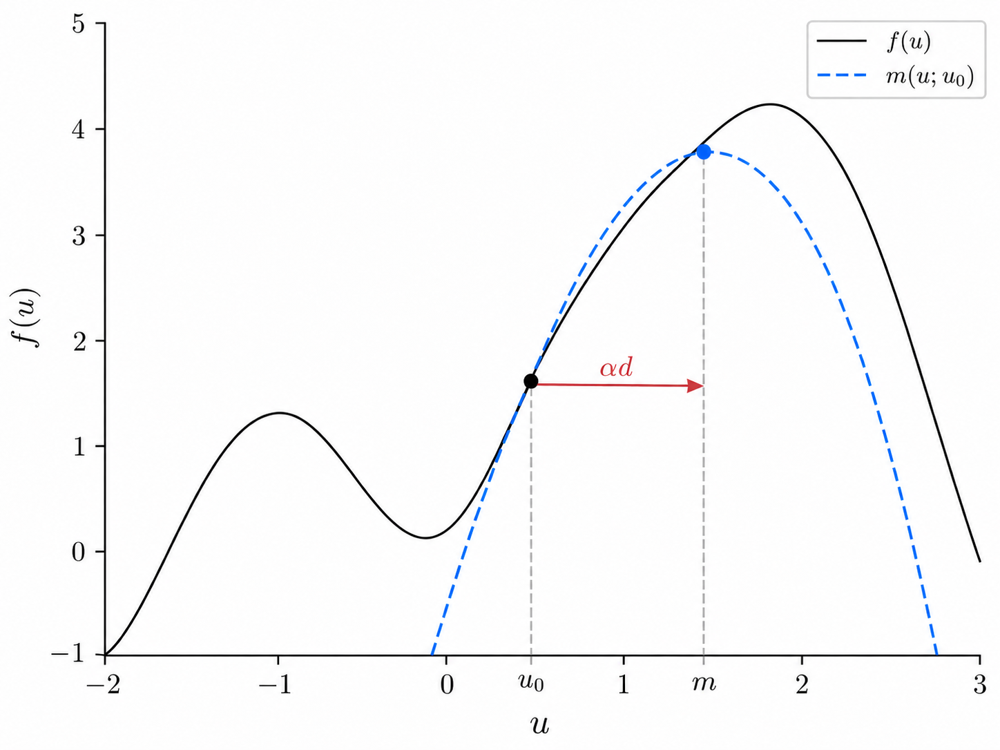
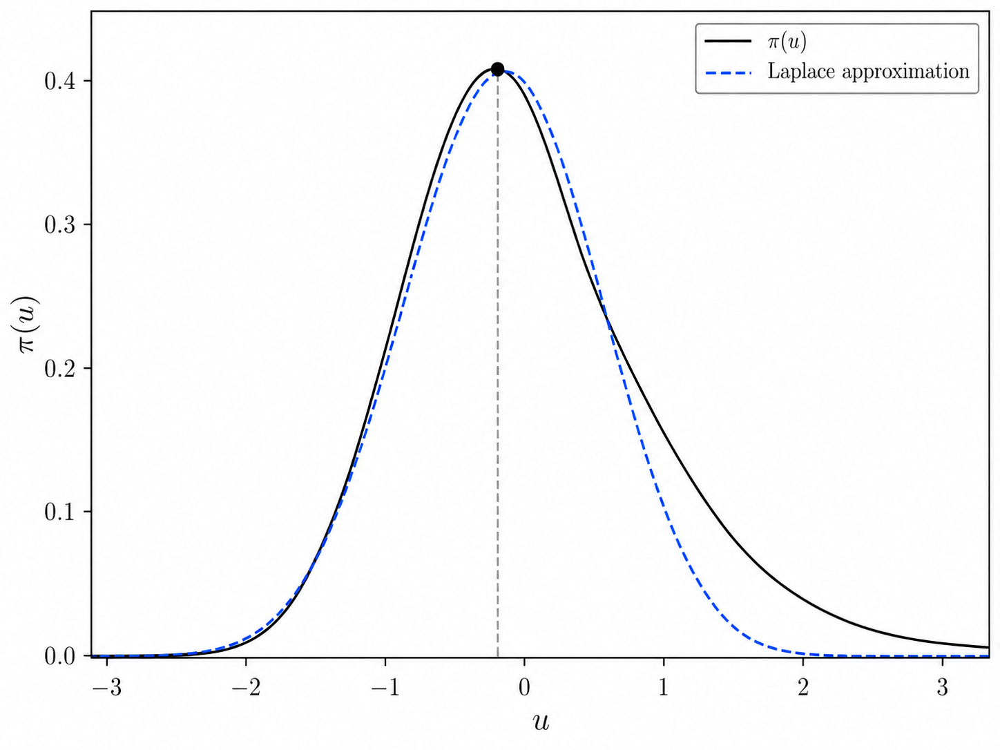
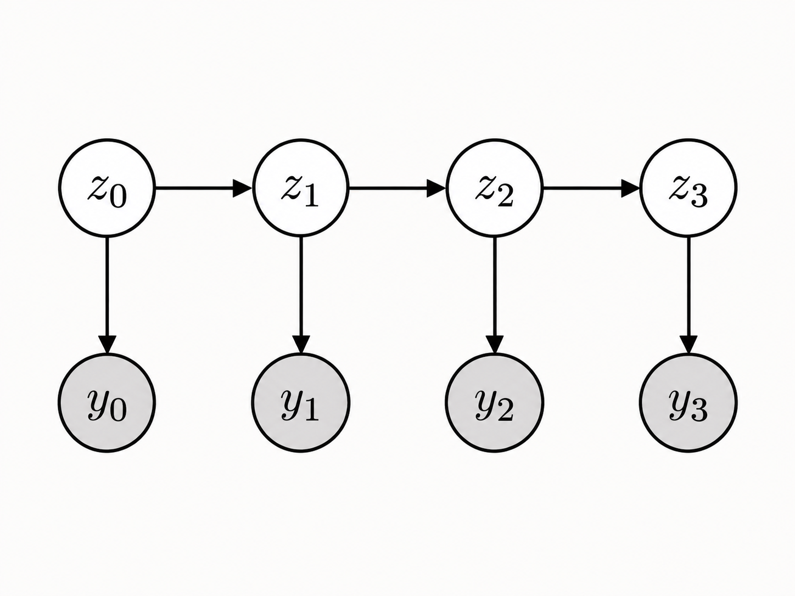
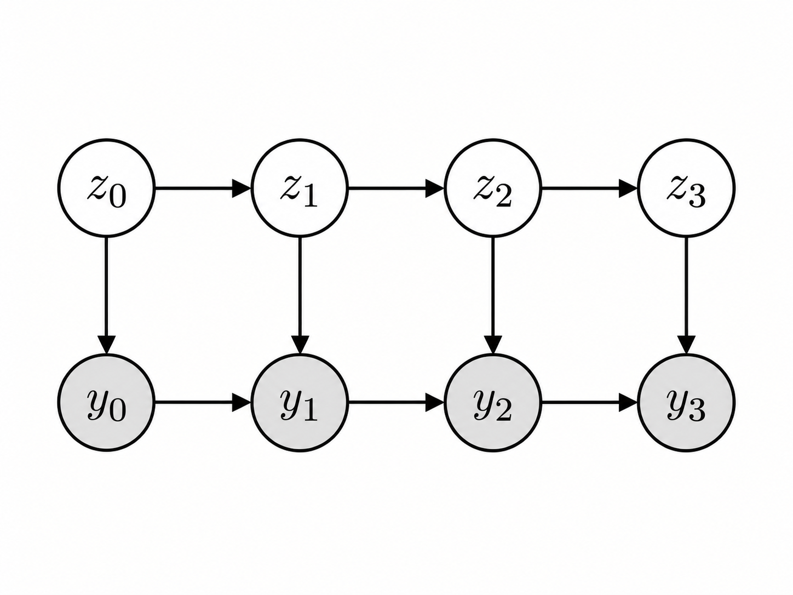
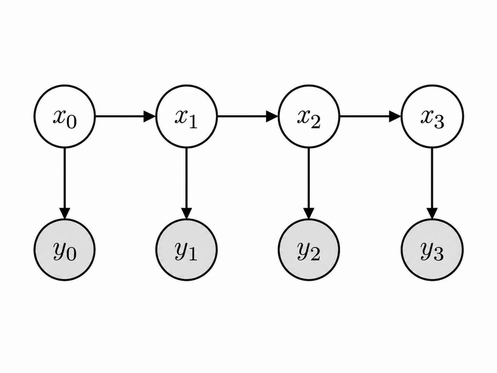
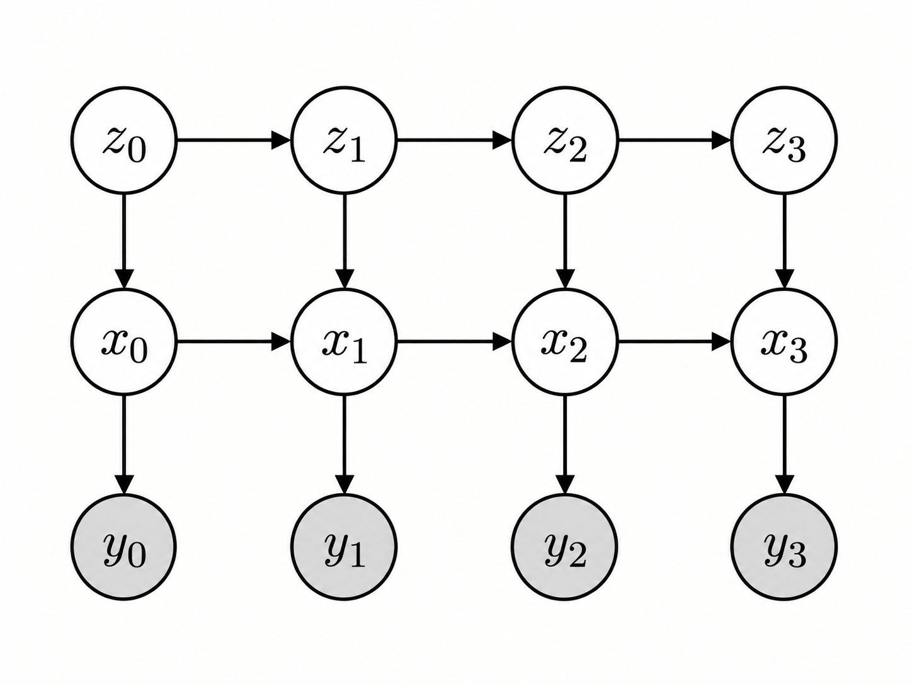
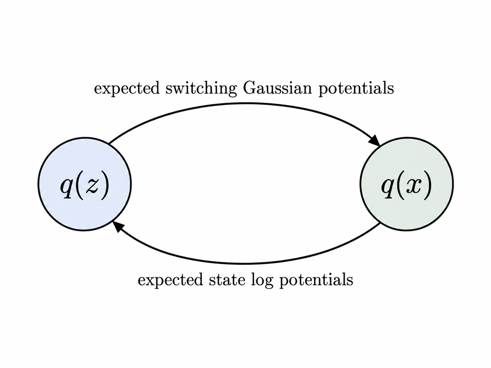

# Mathematics

`xxm` builds latent-variable models from a small collection of reusable mathematical structures. The complete models differ in what their latent variables represent and how observations depend on them, but much of their inference and learning reduces to the same underlying operations.

A hidden Markov model reduces posterior inference to normalization and marginalization in a finite-state chain. A linear dynamical system with Gaussian observations reduces to the corresponding problem for a Gaussian chain. When an observation model is not quadratic in the continuous latent state, as with Poisson observations, this Gaussian structure is lost and must be recovered approximately through a local quadratic expansion. A switching linear dynamical system combines the discrete and continuous chains, making exact joint inference difficult and motivating a structured approximation that alternates between them.

The recurring pattern is therefore

$$
\text{local distributions}
\longrightarrow
\text{potentials}
\longrightarrow
\text{chain inference}
\longrightarrow
\text{posterior moments}
\longrightarrow
\text{parameter fitting}.
$$

When exact chain structure breaks, `xxm` introduces only the additional machinery needed to restore a tractable approximation:

$$
\text{Newton optimization}
+
\text{local quadratic approximation}
\longrightarrow
\text{Laplace inference}.
$$

This chapter develops those reusable pieces independently of any complete model. Chapter 2 then assembles them into HMMs, AR-HMMs, LDSs, and SLDSs, with particular emphasis on why each inference problem is difficult and which pieces of this chapter make it tractable.

## Notation and terminology

Throughout the model-level discussion,

* $z$ denotes a discrete latent state;
* $x$ denotes a continuous latent state;
* $y$ denotes an observation.

The main dimensions are

| Symbol             | Meaning                             |
| ------------------ | ----------------------------------- |
| $t=0,\ldots,T-1$ | time index                          |
| $T$              | number of time steps                |
| $K$              | number of discrete latent states    |
| $L$              | number of autoregressive lags       |
| $D_x$            | continuous latent dimension         |
| $D_y$            | observation dimension               |
| $I,O$            | generic input and output dimensions |

For mathematical objects that are not specifically latent states or observations, neutral variables such as $u$ and $v$ are preferred.

A **distribution** is normalized. A **potential** is a nonnegative factor that need not be normalized. If

$$
q(u)=\frac{f(u)}{Z},
$$

then $Z$ is the **normalizing constant** and $\log Z$ is its **log normalizer**. It is called a marginal likelihood only when the surrounding probabilistic model makes

$$
Z=p(y).
$$

A **moment** is an expectation such as

$$
\mathbb E[u]
\qquad\text{or}\qquad
\mathbb E[uu^\top].
$$

The covariance is the centered second moment,

$$
\operatorname{Cov}(u)
=
\mathbb E
\left[
(u-\mathbb E[u])
(u-\mathbb E[u])^\top
\right],
$$

and should not be confused with the raw second moment. They are related by

$$
\mathbb E[uu^\top]
=
\operatorname{Cov}(u)
+
\mathbb E[u]\mathbb E[u]^\top.
$$

For two variables $u\in\mathbb R^I$ and $v\in\mathbb R^O$, the cross-covariance convention is

$$
\operatorname{Cov}(u,v)
=
\mathbb E
\left[
(u-\mathbb E[u])
(v-\mathbb E[v])^\top
\right],
$$

with shape $I\times O$. Correspondingly,

$$
\mathbb E[uv^\top]
$$

and

$$
\mathbb E[vu^\top]
$$

have different orientations and are not interchangeable.

# 1. Core mathematical machinery

## 1.1 Affine maps

Many of the conditional distributions in `xxm` share the same deterministic component: an affine map

$$
f(u)=Wu+b,
$$

where $W$ contains linear coefficients and $b$ is a bias.

For vector-valued $u\in\mathbb R^I$ and $f(u)\in\mathbb R^O$,

$$
W\in\mathbb R^{O\times I},
\qquad
b\in\mathbb R^O.
$$

The distinction between the affine map and the distribution built around it is useful. The same map can define the conditional mean of a Gaussian distribution,

$$
v\mid u
\sim
\mathcal N(Wu+b,\Sigma),
$$

or the conditional log rate of a Poisson distribution,

$$
v\mid u
\sim
\operatorname{Poisson}(\exp(Wu+b)).
$$

It also describes latent dynamics, emission mappings, autoregressive predictors, and changes of latent coordinates.

### Structured inputs

An input need not be represented mathematically as a single vector. If $u$ has shape

$$
I_1\times\cdots\times I_r,
$$

the coefficients may be regarded as a tensor

$$
W\in
\mathbb R^{O\times I_1\times\cdots\times I_r},
$$

with

$$
f(u)_o
=
\sum_{i_1,\ldots,i_r}
W_{o,i_1,\ldots,i_r}
u_{i_1,\ldots,i_r}
+b_o.
$$

This is mathematically equivalent to flattening the input dimensions and applying an ordinary matrix-vector product. The structured representation is useful when those dimensions have meaning, for example when an autoregressive predictor separates lag and observation dimensions.

### Composition

Affine maps are closed under composition. If

$$
f(u)=W_fu+b_f
$$

and

$$
g(v)=W_gv+b_g,
$$

then

$$
(f\circ g)(v)
=
W_fW_gv
+
W_fb_g
+
b_f.
$$

Thus the composed affine map has coefficients

$$
W_{f\circ g}=W_fW_g
$$

and bias

$$
b_{f\circ g}=W_fb_g+b_f.
$$

This closure is useful when changing coordinates or composing an observation mapping with a latent transformation.

### Inverse and pseudoinverse

If $W$ is square and invertible,

$$
v=Wu+b
$$

can be solved exactly for $u$:

$$
u
=
W^{-1}v-W^{-1}b.
$$

The inverse affine map is therefore

$$
f^{-1}(v)
=
W^{-1}v-W^{-1}b.
$$

When $W$ is not invertible, its Moore-Penrose pseudoinverse $W^+$ defines the corresponding least-squares affine map

$$
f^+(v)
=
W^+(v-b).
$$

Unlike a true inverse, this does not in general recover every input exactly.

### Shifting the input origin

It is sometimes useful to describe the same map in coordinates centered around some value $c$. If

$$
w=u-c,
$$

then

$$
f(u)
=
W(w+c)+b
=
Ww+(Wc+b).
$$

Changing the input origin therefore leaves the coefficients unchanged and modifies only the bias.

## 1.2 Distributions and conditional distributions

### 1.2.1 Categorical distributions

A categorical distribution over $K$ possibilities is specified by probabilities

$$
\rho_k\geq 0,
\qquad
\sum_{k=0}^{K-1}\rho_k=1.
$$

For

$$
u\sim\operatorname{Categorical}(\rho),
$$

the probability of category $k$ is

$$
p(u=k)=\rho_k.
$$

Categorical distributions will later describe initial discrete states and rows of discrete transition matrices. At the core level, however, they are simply normalized finite distributions.

### 1.2.2 Gaussian distributions

A $D$-dimensional Gaussian distribution in moment form is written

$$
u\sim\mathcal N(\mu,\Sigma),
$$

where

$$
\mu=\mathbb E[u]
$$

and

$$
\Sigma=\operatorname{Cov}(u).
$$

Its log density is

$$
\log p(u)
=
-\frac12
(u-\mu)^\top
\Sigma^{-1}
(u-\mu)
-\frac12\log\det\Sigma
-\frac D2\log(2\pi).
$$

The marginal variance of component $i$ is the corresponding diagonal entry,

$$
\operatorname{Var}(u_i)=\Sigma_{ii}.
$$

The raw second moment is

$$
\mathbb E[uu^\top]
=
\Sigma+\mu\mu^\top.
$$

The distinction between covariance and raw second moment becomes important in both expected log probabilities and parameter fitting.

#### Affine transformation of a Gaussian

If

$$
u\sim\mathcal N(\mu,\Sigma)
$$

and

$$
v=Wu+b,
$$

then $v$ is also Gaussian:

$$
v
\sim
\mathcal N
\left(
W\mu+b,
W\Sigma W^\top
\right).
$$

Thus

$$
\mathbb E[v]
=
W\mu+b
$$

and

$$
\operatorname{Cov}(v)
=
W\Sigma W^\top.
$$

This closure under affine transformations is one of the central reasons Gaussian models remain analytically tractable.

### 1.2.3 Linear-Gaussian conditionals

A linear-Gaussian conditional has the form

$$
v\mid u
\sim
\mathcal N(Wu+b,\Sigma).
$$

For a deterministic input $u$,

$$
\mathbb E[v\mid u]
=
Wu+b
$$

and

$$
\operatorname{Cov}(v\mid u)=\Sigma.
$$

Now suppose the input is itself Gaussian,

$$
u\sim\mathcal N(\mu_u,\Sigma_u).
$$

Writing

$$
v=Wu+b+\varepsilon,
\qquad
\varepsilon\sim\mathcal N(0,\Sigma),
$$

with $\varepsilon$ independent of $u$, gives

$$
\mathbb E[v]
=
W\mu_u+b
$$

and

$$
\operatorname{Cov}(v)
=
W\Sigma_uW^\top+\Sigma.
$$

The input-output cross-covariance is

$$
\operatorname{Cov}(u,v)
=
\Sigma_uW^\top.
$$

These identities allow linear-Gaussian conditionals to be fitted directly from joint moments.

#### Composition at the input

Suppose

$$
u=W'u'+b'.
$$

Then

$$
v\mid u'
\sim
\mathcal N
\left(
W(W'u'+b')+b,
\Sigma
\right),
$$

so

$$
v\mid u'
\sim
\mathcal N
\left(
WW'u'+Wb'+b,
\Sigma
\right).
$$

Precomposing a linear-Gaussian conditional with an affine transformation therefore changes only its affine mean map.

#### Composition at the output

If

$$
w=W'v+b',
$$

then conditional on $u$,

$$
w\mid u
\sim
\mathcal N
\left(
W'(Wu+b)+b',
W'\Sigma W'^\top
\right).
$$

Thus affine output transformations preserve the linear-Gaussian family.

### 1.2.4 Paired Gaussian variables

For jointly Gaussian variables $u$ and $v$, write

$$
\begin{bmatrix}
u\\
v
\end{bmatrix}
\sim
\mathcal N
\left(
\begin{bmatrix}
\mu_u\\
\mu_v
\end{bmatrix},
\begin{bmatrix}
\Sigma_u & \Sigma_{uv}\\
\Sigma_{uv}^\top & \Sigma_v
\end{bmatrix}
\right),
$$

where

$$
\Sigma_{uv}
=
\operatorname{Cov}(u,v).
$$

The orientation is important:

$$
\Sigma_{uv}\in\mathbb R^{I\times O},
$$

where $I$ is the dimension of $u$ and $O$ the dimension of $v$.

The raw cross moment is

$$
\mathbb E[uv^\top]
=
\Sigma_{uv}
+
\mu_u\mu_v^\top.
$$

Joint Gaussian moments are the natural quantities for fitting a linear-Gaussian relationship between two uncertain variables.

### 1.2.5 Poisson distributions

For independent Poisson variables,

$$
u_i\sim\operatorname{Poisson}(\lambda_i),
$$

with rate

$$
\lambda_i>0.
$$

Their joint probability factorizes across dimensions:

$$
p(u)
=
\prod_i
\frac{\lambda_i^{u_i}e^{-\lambda_i}}{u_i!}.
$$

The corresponding log probability is

$$
\log p(u)
=
\sum_i
\left(
u_i\log\lambda_i
-
\lambda_i
-
\log(u_i!)
\right).
$$

It is often convenient to work with the log rate

$$
\eta_i=\log\lambda_i,
$$

so that

$$
\lambda_i=e^{\eta_i}
$$

and

$$
\log p(u)
=
\sum_i
\left(
u_i\eta_i
-
e^{\eta_i}
-
\log(u_i!)
\right).
$$

`xxm` uses log rates as the natural Poisson parameterization.

The mean and variance of each component are both equal to its rate:

$$
\mathbb E[u_i]
=
\operatorname{Var}(u_i)
=
\lambda_i.
$$

### 1.2.6 Linear-Poisson conditionals

A linear-Poisson conditional uses an affine predictor for the log rate:

$$
v\mid u
\sim
\operatorname{Poisson}(\lambda(u)),
$$

with

$$
\eta(u)
=
\log\lambda(u)
=
Wu+b.
$$

Equivalently,

$$
v\mid u
\sim
\operatorname{Poisson}(\exp(Wu+b)).
$$

The affine structure is particularly useful when $u$ is Gaussian.

Suppose

$$
u\sim\mathcal N(\mu,\Sigma).
$$

Then the log rate

$$
\eta=Wu+b
$$

is Gaussian, with

$$
\mathbb E[\eta]
=
W\mu+b
$$

and

$$
\operatorname{Cov}(\eta)
=
W\Sigma W^\top.
$$

For output component $i$, write

$$
m_{\eta,i}
=
\mathbb E[\eta_i],
\qquad
s_{\eta,i}^2
=
\operatorname{Var}(\eta_i).
$$

Because the exponential of a Gaussian variable has an analytic mean,

$$
\mathbb E[\lambda_i]
=
\mathbb E[e^{\eta_i}]
=
\exp
\left(
m_{\eta,i}
+\frac12s_{\eta,i}^2
\right).
$$

This identity is important later. A Poisson observation model is not Gaussian in its input, but several of its expectations under a Gaussian input remain available in closed form.

For a fixed observed count $v_i$,

$$
\log p(v_i\mid u)
=
v_i\eta_i
-
e^{\eta_i}
-
\log(v_i!).
$$

Taking the expectation under a Gaussian distribution for $u$,

$$
\mathbb E[\log p(v_i\mid u)]
=
v_i m_{\eta,i}
-
\exp
\left(
m_{\eta,i}
+\frac12s_{\eta,i}^2
\right)
-
\log(v_i!).
$$

Thus an expected Poisson log likelihood can be evaluated exactly from the mean and covariance of a Gaussian input even though the posterior induced by a Poisson likelihood is not itself Gaussian.

## 1.3 Moments and parameter fitting

Inference and learning repeatedly pass information through moments.

A posterior distribution may describe uncertainty over a latent variable, but many parameter updates do not require the complete posterior density. They require quantities such as

$$
\mathbb E[u],
\qquad
\mathbb E[uu^\top],
\qquad
\mathbb E[uv^\top],
$$

possibly weighted by discrete-state probabilities.

This section develops the corresponding fitting operations.

### 1.3.1 Gaussian moments from samples

Given samples

$$
u_1,\ldots,u_N,
$$

their empirical mean is

$$
\mu
=
\frac1N
\sum_{n=1}^N u_n.
$$

The corresponding empirical second central moment is

$$
\Sigma
=
\frac1N
\sum_{n=1}^N
(u_n-\mu)(u_n-\mu)^\top.
$$

These are the moment estimates used to define a fitted Gaussian

$$
\mathcal N(\mu,\Sigma).
$$

More generally, let normalized nonnegative weights satisfy

$$
\omega_n\geq0,
\qquad
\sum_n \omega_n=1.
$$

Then

$$
\mu
=
\sum_n \omega_nu_n
$$

and

$$
\Sigma
=
\sum_n
\omega_n
(u_n-\mu)(u_n-\mu)^\top.
$$

This weighted form is the one that later appears when posterior state probabilities act as soft assignments.

### 1.3.2 Moment matching uncertain Gaussian variables

Now suppose the indexed objects are themselves uncertain:

$$
u_n
\sim
\mathcal N(\mu_n,\Sigma_n).
$$

We want a single Gaussian whose first two moments match the weighted mixture of these distributions.

For normalized weights $\omega_n$,

$$
\mu
=
\sum_n\omega_n\mu_n.
$$

The raw second moment of the mixture is

$$
\mathbb E[uu^\top]
=
\sum_n
\omega_n
\left(
\Sigma_n+\mu_n\mu_n^\top
\right).
$$

Therefore the matched covariance is

$$
\Sigma
=
\sum_n
\omega_n
\left[
\Sigma_n
+
(\mu_n-\mu)(\mu_n-\mu)^\top
\right].
$$

The two terms have different meanings:

$$
\underbrace{
\sum_n\omega_n\Sigma_n
}_{\text{within-distribution uncertainty}}
+
\underbrace{
\sum_n
\omega_n
(\mu_n-\mu)(\mu_n-\mu)^\top
}_{\text{variation of means}}.
$$

Discarding either term would generally give the wrong covariance.

The same principle applies to paired Gaussian variables: marginal second moments and cross moments are averaged first, then converted back into means, covariances, and cross-covariances.

### 1.3.3 Paired moments from samples

Given aligned pairs

$$
(u_n,v_n),
$$

define

$$
\mu_u
=
\sum_n\omega_nu_n,
\qquad
\mu_v
=
\sum_n\omega_nv_n.
$$

Their marginal covariances are

$$
\Sigma_u
=
\sum_n
\omega_n
(u_n-\mu_u)(u_n-\mu_u)^\top,
$$

$$
\Sigma_v
=
\sum_n
\omega_n
(v_n-\mu_v)(v_n-\mu_v)^\top,
$$

and the cross-covariance is

$$
\Sigma_{uv}
=
\sum_n
\omega_n
(u_n-\mu_u)(v_n-\mu_v)^\top.
$$

Equivalently, the raw cross moment is

$$
\mathbb E[uv^\top]
=
\Sigma_{uv}
+
\mu_u\mu_v^\top.
$$

This paired representation is sufficient to fit a linear-Gaussian conditional.

The same construction also applies when one side is uncertain. If each input is represented by a Gaussian marginal while the corresponding output is deterministic, the input covariance contributes to the paired second moments even though there is no within-sample uncertainty in the output.

### 1.3.4 Linear-Gaussian fitting from joint moments

Suppose $u$ and $v$ have joint Gaussian moments

$$
\mu_u,\quad
\mu_v,\quad
\Sigma_u,\quad
\Sigma_v,\quad
\Sigma_{uv}.
$$

The Gaussian conditional of $v$ given $u$ is

$$
v\mid u
\sim
\mathcal N(Wu+b,\Sigma),
$$

where

$$
W
=
\Sigma_{uv}^\top\Sigma_u^{-1},
$$

$$
b
=
\mu_v-W\mu_u,
$$

and

$$
\Sigma
=
\Sigma_v
-
\Sigma_{uv}^\top
\Sigma_u^{-1}
\Sigma_{uv}.
$$

Thus linear-Gaussian fitting can be understood as two operations:

1. aggregate samples or uncertain marginals into joint moments;
2. convert those joint moments into a Gaussian conditional.

This decomposition is used repeatedly in continuous-state parameter updates.

When the input covariance is poorly conditioned, the regression solve may be regularized by replacing it with a ridge-regularized system. This changes the fitted conditional from the exact Gaussian conditional to a regularized approximation, while preserving the same moment-based interpretation.

### 1.3.5 Poisson fitting from samples

For a scalar Poisson variable,

$$
u\sim\operatorname{Poisson}(\lambda),
$$

the mean satisfies

$$
\mathbb E[u]=\lambda.
$$

The maximum-likelihood rate fitted from samples is therefore their empirical mean,

$$
\hat\lambda
=
\frac1N\sum_nu_n.
$$

With normalized weights,

$$
\hat\lambda
=
\sum_n\omega_nu_n.
$$

For independent multidimensional Poisson variables, the same calculation is applied componentwise.

If the model is represented in log-rate form,

$$
\eta=\log\lambda,
$$

the fitted parameter is

$$
\hat\eta=\log\hat\lambda.
$$

This gives a closed-form fit for an unconditional Poisson distribution.

### 1.3.6 Linear-Poisson fitting

The conditional case is different.

Let

$$
v_n\mid u_n
\sim
\operatorname{Poisson}
\left(
\exp(Wu_n+b)
\right).
$$

Writing

$$
\eta_n=Wu_n+b,
$$

the weighted log likelihood, up to terms independent of $W$ and $b$, is

$$
\mathcal J(W,b)
=
\sum_n\omega_n
\left[
v_n^\top\eta_n
-
\mathbf 1^\top e^{\eta_n}
\right].
$$

Unlike Gaussian linear regression, maximizing this objective does not reduce to solving directly for first and second moments.

The same issue remains when the inputs are uncertain Gaussian variables. If

$$
u_n
\sim
\mathcal N(\mu_n,\Sigma_n),
$$

then

$$
\eta_n=Wu_n+b
$$

is Gaussian. Its mean is

$$
m_n=W\mu_n+b,
$$

and the variance of output component $i$ is

$$
s_{n,i}^2
=
w_i^\top\Sigma_nw_i,
$$

where $w_i^\top$ is row $i$ of $W$.

The expected log likelihood contains the analytically available rate expectation

$$
\mathbb E[e^{\eta_{n,i}}]
=
\exp
\left(
m_{n,i}+\frac12s_{n,i}^2
\right).
$$

The resulting objective is differentiable but still has no Gaussian-style closed-form regression solution. `xxm` therefore fits linear-Poisson models numerically using damped Newton optimization, developed in Section 1.6.

This is the first example of an important distinction that will recur later:

> An expectation may be available analytically even when optimization or posterior inference is not.

## 1.4 Potentials

Normalized distributions are convenient when describing generative models and sampling. Inference often requires a different operation: combine several factors that all depend on the same unknown variable.

Potentials provide this language.

A potential

$$
\phi(u)\geq0
$$

does not need to satisfy

$$
\int\phi(u)\,du=1.
$$

If several factors depend on $u$, their product defines an unnormalized distribution:

$$
f(u)
=
\prod_r\phi_r(u).
$$

The normalized distribution is

$$
q(u)
=
\frac{f(u)}{Z},
$$

where

$$
Z
=
\int f(u)\,du
$$

or the corresponding sum for discrete variables.

Working in log space turns products of potentials into sums:

$$
\log f(u)
=
\sum_r\log\phi_r(u).
$$

This simple observation is central to both discrete and Gaussian chain inference.

### 1.4.1 Discrete unary potentials

For a discrete variable with $K$ possible values, a unary potential can be represented by

$$
\phi(k),
\qquad
k=0,\ldots,K-1.
$$

It is often more convenient to use its log potential

$$
\ell(k)=\log\phi(k).
$$

For a time-indexed sequence,

$$
\phi_t(z_t)
$$

denotes a local factor depending only on state $z_t$, and

$$
\ell_t(k)
=
\log\phi_t(k).
$$

These potentials will later allow an observation likelihood or an expected switching factor to modify a discrete Markov chain without changing its chain structure.

### 1.4.2 Gaussian canonical potentials

A Gaussian potential is written in canonical form as

$$
\log\phi(u)
=
-\frac12u^\top Ju
+
h^\top u
+
c.
$$

Here

* $J$ is the precision coefficient;
* $h$ is the information vector;
* $c$ is the log constant.

When $J$ is positive definite, this potential can be normalized to a Gaussian distribution.

Completing the square gives

$$
\mu=J^{-1}h
$$

and

$$
\Sigma=J^{-1}.
$$

The log normalizer is

$$
\log Z
=
c
+
\frac12h^\top J^{-1}h
+
\frac D2\log(2\pi)
-
\frac12\log\det J.
$$

Thus

$$
q(u)
=
\frac{\phi(u)}{Z}
=
\mathcal N(u\mid\mu,\Sigma).
$$

Canonical form is especially useful for inference because products of Gaussian potentials remain Gaussian potentials.

If

$$
\log\phi_r(u)
=
-\frac12u^\top J_ru
+
h_r^\top u
+
c_r,
$$

then

$$
\log\prod_r\phi_r(u)
=
-\frac12
u^\top
\left(
\sum_rJ_r
\right)
u
+
\left(
\sum_rh_r
\right)^\top u
+
\sum_rc_r.
$$

The canonical parameters simply add.

This is the basic algebra underlying Gaussian-chain construction.

### 1.4.3 From a Gaussian distribution to a potential

Consider

$$
u\sim\mathcal N(\mu,\Sigma).
$$

Let

$$
J=\Sigma^{-1}.
$$

Expanding its normalized log density gives

$$
\log p(u)
=
-\frac12u^\top Ju
+
(J\mu)^\top u
+
c,
$$

so

$$
h=J\mu.
$$

The constant is

$$
c
=
-\frac12\mu^\top J\mu
-\frac12\log\det\Sigma
-\frac D2\log(2\pi).
$$

A normalized Gaussian distribution is therefore a particular Gaussian potential whose normalizing constant is one.

The distinction is still useful: later inference combines normalized Gaussian model factors with unnormalized likelihood or expected factors, after which the resulting object is no longer normalized until its new $Z$ is computed.

### 1.4.4 Gaussian likelihood as a potential over its input

Suppose

$$
v\mid u
\sim
\mathcal N(Wu+b,\Sigma)
$$

and $v$ is observed.

As a function of $u$,

$$
p(v\mid u)
$$

is not a normalized distribution over $u$, but it is a Gaussian potential over $u$.

Let

$$
\Lambda=\Sigma^{-1}.
$$

Then

$$
\log p(v\mid u)
=
-\frac12
(v-Wu-b)^\top
\Lambda
(v-Wu-b)
-
\frac12\log\det\Sigma
-
\frac O2\log(2\pi).
$$

Collecting terms in $u$,

$$
\log p(v\mid u)
=
-\frac12u^\top Ju
+
h^\top u
+
c,
$$

with

$$
J
=
W^\top\Lambda W,
$$

$$
h
=
W^\top\Lambda(v-b),
$$

and

$$
c
=
-\frac12
(v-b)^\top
\Lambda
(v-b)
-
\frac12\log\det\Sigma
-
\frac O2\log(2\pi).
$$

This result will later make Gaussian LDS inference immediate: every Gaussian observation contributes a unary Gaussian potential over the corresponding latent state.

### 1.4.5 Gaussian pair potentials

Temporal dynamics depend on two adjacent variables rather than one. Their Gaussian factors are naturally represented by pair potentials.

For variables $u$ and $v$ of the same dimension, use

$$
\log\phi(u,v)
=
-\frac12u^\top J_{00}u
-
v^\top J_{10}u
-
\frac12v^\top J_{11}v
+
h_0^\top u
+
h_1^\top v
+
c.
$$

The lower off-diagonal precision block is

$$
J_{10},
$$

and the corresponding upper block is

$$
J_{01}=J_{10}^\top.
$$

This orientation is fixed throughout the Gaussian-chain discussion.

A linear-Gaussian conditional

$$
v\mid u
\sim
\mathcal N(Wu+b,\Sigma)
$$

is exactly such a pair potential.

Let

$$
\Lambda=\Sigma^{-1}.
$$

Expanding

$$
-\frac12
(v-Wu-b)^\top
\Lambda
(v-Wu-b)
$$

gives

$$
J_{00}
=
W^\top\Lambda W,
$$

$$
J_{11}
=
\Lambda,
$$

$$
J_{10}
=
-\Lambda W,
$$

$$
h_0
=
-W^\top\Lambda b,
$$

$$
h_1
=
\Lambda b,
$$

and

$$
c
=
-\frac12b^\top\Lambda b
-
\frac12\log\det\Sigma
-
\frac D2\log(2\pi).
$$

The sign of the lower block follows from the convention

$$
-v^\top J_{10}u.
$$

This conversion is what allows linear-Gaussian dynamics to become local factors of a Gaussian chain.

### 1.4.6 Weighted sums of Gaussian log potentials

Suppose there is a family of Gaussian potentials

$$
\phi_k(u),
\qquad
k=0,\ldots,K-1,
$$

with canonical parameters

$$
J_k,\quad h_k,\quad c_k.
$$

For weights $\omega_k$, consider the weighted log potential

$$
\log\phi(u)
=
\sum_k\omega_k\log\phi_k(u).
$$

Because canonical parameters enter linearly,

$$
J
=
\sum_k\omega_kJ_k,
$$

$$
h
=
\sum_k\omega_kh_k,
$$

and

$$
c
=
\sum_k\omega_kc_k.
$$

This operation will later be central to switching models. Averaging the **log factors** associated with several possible discrete states produces another Gaussian potential, so expectations over a discrete posterior can preserve Gaussian-chain structure.

### 1.4.7 Expected Gaussian log potentials

The reverse operation is equally important.

Suppose

$$
\log\phi(u)
=
-\frac12u^\top Ju
+
h^\top u
+
c
$$

and $u$ is distributed according to some distribution $q$ with mean

$$
m=\mathbb E_q[u]
$$

and raw second moment

$$
M=\mathbb E_q[uu^\top].
$$

Then

$$
\mathbb E_q[\log\phi(u)]
=
-\frac12
\operatorname{tr}(JM)
+
h^\top m
+
c.
$$

Only the first and second moments of $q$ are required.

For a Gaussian $q$,

$$
M
=
\operatorname{Cov}_q(u)+mm^\top.
$$

For a pair potential,

$$
\log\phi(u,v)
=
-\frac12u^\top J_{00}u
-
v^\top J_{10}u
-
\frac12v^\top J_{11}v
+
h_0^\top u
+
h_1^\top v
+
c,
$$

the expectation depends on

$$
\mathbb E[uu^\top],
\qquad
\mathbb E[vv^\top],
\qquad
\mathbb E[uv^\top],
\qquad
\mathbb E[u],
\qquad
\mathbb E[v].
$$

In particular,

$$
\mathbb E[v^\top J_{10}u]
=
\operatorname{tr}
\left(
J_{10}
\mathbb E[uv^\top]
\right).
$$

Therefore

$$
\begin{aligned}
\mathbb E[\log\phi(u,v)]
={}&
-\frac12
\operatorname{tr}
\left(
J_{00}\mathbb E[uu^\top]
\right)
\\
&-
\operatorname{tr}
\left(
J_{10}\mathbb E[uv^\top]
\right)
\\
&-
\frac12
\operatorname{tr}
\left(
J_{11}\mathbb E[vv^\top]
\right)
\\
&+
h_0^\top\mathbb E[u]
+
h_1^\top\mathbb E[v]
+
c.
\end{aligned}
$$

This gives the other half of the switching-model interaction: continuous posterior moments can turn a family of state-dependent Gaussian factors into scalar state potentials.

### 1.4.8 Local quadratic potentials

Not every useful likelihood is Gaussian in its input. A smooth log factor can nevertheless be approximated locally by a quadratic function.

Let

$$
\ell(u)=\log\phi(u)
$$

and expand around $u_0$. Write

$$
a=\ell(u_0),
$$

$$
g=\nabla\ell(u_0),
$$

and let

$$
J=-\nabla^2\ell(u_0)
$$

be the negative Hessian.

The second-order expansion is

$$
\ell(u)
\approx
a
+
g^\top(u-u_0)
-
\frac12
(u-u_0)^\top
J
(u-u_0).
$$

Collecting terms gives canonical form,

$$
\ell(u)
\approx
-\frac12u^\top Ju
+
h^\top u
+
c,
$$

with

$$
h
=
g+Ju_0
$$

and

$$
c
=
a
-
g^\top u_0
-
\frac12u_0^\top Ju_0.
$$

A local second-order expansion can therefore be represented by exactly the same Gaussian-potential machinery as a truly Gaussian factor.

This fact becomes important when exact Gaussian structure breaks:

$$
\boxed{
\text{nonquadratic local factor}
\;\xrightarrow{\text{second-order approximation}}\;
\text{Gaussian potential}
}
$$

The next sections use these local potentials to build and normalize complete chain-structured distributions.

## 1.5 Chain-structured distributions and exact inference

A sequence of variables can be treated as one large joint variable, but doing so usually ignores its most useful property: each time step interacts directly with only a small number of neighboring time steps.

`xxm` exploits this local structure in two forms:

* finite-state chains, where normalization requires summing over exponentially many possible trajectories;
* Gaussian chains, where the full precision matrix is block tridiagonal.

In both cases the goal is similar. Given an unnormalized chain potential $f$, compute

$$
q=\frac{f}{Z}
$$

together with the local marginals needed for inference and learning, without solving the corresponding unstructured global problem.

### 1.5.1 Discrete chains

Consider a sequence

$$
z_0,\ldots,z_{T-1},
\qquad
z_t\in\{0,\ldots,K-1\}.
$$

Let

$$
\pi_k=p(z_0=k)
$$

be the initial probabilities and

$$
P_t(i,j)
=
p(z_{t+1}=j\mid z_t=i)
$$

the transition probabilities.

The transitions may vary with time. For a stationary chain, write simply

$$
P(i,j).
$$

Suppose each state also receives a local unary potential

$$
\phi_t(z_t).
$$

The unnormalized chain potential is

$$
f(z_{0:T-1})
=
\pi_{z_0}
\prod_{t=0}^{T-2}
P_t(z_t,z_{t+1})
\prod_{t=0}^{T-1}
\phi_t(z_t).
$$

Equivalently, using

$$
\ell_t(k)=\log\phi_t(k),
$$

the log potential is

$$
\log f(z)
=
\log\pi_{z_0}
+
\sum_{t=0}^{T-2}
\log P_t(z_t,z_{t+1})
+
\sum_{t=0}^{T-1}
\ell_t(z_t).
$$

The normalized chain distribution is

$$
q(z)=\frac{f(z)}{Z},
$$

where

$$
Z
=
\sum_{z_0,\ldots,z_{T-1}}
f(z_0,\ldots,z_{T-1}).
$$

#### The normalization problem

There are

$$
K^T
$$

possible state trajectories. Direct computation of $Z$ by enumerating them therefore grows exponentially with the sequence length.

The same apparent problem arises when computing local marginals such as

$$
q(z_t=k)
$$

or

$$
q(z_t=i,z_{t+1}=j),
$$

because each marginal sums over every other state in the trajectory.

The chain factorization avoids this enumeration. Partial sums over the past and future can be reused recursively, reducing inference to operations involving neighboring time steps.

With dense transition matrices, the resulting recursion scales as $O(TK^2)$ rather than with the $K^T$ possible trajectories.

#### Normalized forward recursion

Let $m_t^{\mathrm{fwd}}(k)$ denote the normalized forward message. The first unnormalized message is

$$
\widetilde m_0^{\mathrm{fwd}}(k)
=
\pi_k\phi_0(k).
$$

Its scaling factor is

$$
s_0
=
\sum_k
\widetilde m_0^{\mathrm{fwd}}(k),
$$

and the normalized message is

$$
m_0^{\mathrm{fwd}}(k)
=
\frac{
\widetilde m_0^{\mathrm{fwd}}(k)
}{
s_0
}.
$$

For $t>0$,

$$
\widetilde m_t^{\mathrm{fwd}}(j)
=
\phi_t(j)
\sum_i
m_{t-1}^{\mathrm{fwd}}(i)
P_{t-1}(i,j).
$$

Normalize again with

$$
s_t
=
\sum_j
\widetilde m_t^{\mathrm{fwd}}(j)
$$

and

$$
m_t^{\mathrm{fwd}}(j)
=
\frac{
\widetilde m_t^{\mathrm{fwd}}(j)
}{
s_t
}.
$$

Each forward message therefore sums to one,

$$
\sum_km_t^{\mathrm{fwd}}(k)=1.
$$

The normalization at each step is not merely a numerical convenience. The removed scaling factors retain exactly the information required to reconstruct the global normalizer.

Let $F_t(j)$ denote the corresponding unnormalized forward sum over all trajectories ending in state $j$. The normalized recursion implies

$$
F_t(j)
=
\left(
\prod_{r=0}^{t}s_r
\right)
m_t^{\mathrm{fwd}}(j).
$$

At the final step,

$$
Z
=
\sum_jF_{T-1}(j).
$$

Since the normalized message sums to one,

$$
Z
=
\prod_{t=0}^{T-1}s_t.
$$

Therefore

$$
\boxed{
\log Z
=
\sum_{t=0}^{T-1}\log s_t
}
$$

without ever enumerating complete trajectories.

#### Scaled backward recursion

The forward pass contains all information from the past. To compute local marginals, we also need the contribution of the future.

Let the scaled backward message terminate at

$$
m_{T-1}^{\mathrm{bwd}}(k)=1.
$$

For $t=T-2,\ldots,0$,

$$
m_t^{\mathrm{bwd}}(i)
=
\frac{
\sum_j
P_t(i,j)
\phi_{t+1}(j)
m_{t+1}^{\mathrm{bwd}}(j)
}{
s_{t+1}
}.
$$

The denominator is the same scaling factor removed during the forward pass.

These backward messages are **not** probability distributions over states and need not sum to one. Their scaling is chosen so that they combine directly with the normalized forward messages.

#### State marginals

The state marginal is

$$
\gamma_t(k)
=
q(z_t=k).
$$

With the scaled messages above,

$$
\boxed{
\gamma_t(k)
=
m_t^{\mathrm{fwd}}(k)
m_t^{\mathrm{bwd}}(k)
}
$$

up to floating-point normalization error.

The scaling conventions ensure

$$
\sum_k\gamma_t(k)=1.
$$

Each marginal combines the contribution of

* the initial distribution and local factors up to time $t$, through $m_t^{\mathrm{fwd}}$;
* all factors after time $t$, through $m_t^{\mathrm{bwd}}$.

#### Adjacent-state marginals

Learning transition models requires the joint marginal of neighboring states,

$$
\xi_t(i,j)
=
q(z_t=i,z_{t+1}=j).
$$

Combining the forward message at $t$, the transition, the local potential at $t+1$, and the remaining backward message gives

$$
\boxed{
\xi_t(i,j)
=
\frac{
m_t^{\mathrm{fwd}}(i)
P_t(i,j)
\phi_{t+1}(j)
m_{t+1}^{\mathrm{bwd}}(j)
}{
s_{t+1}
}.
}
$$

These marginals satisfy

$$
\sum_j\xi_t(i,j)
=
\gamma_t(i)
$$

and

$$
\sum_i\xi_t(i,j)
=
\gamma_{t+1}(j).
$$

Thus the complete normalized chain need not be represented explicitly. For the local expectations used throughout `xxm`, the state and adjacent-state marginals are sufficient.

#### Expected log potential

The expectation of the unnormalized chain log potential is

$$
\mathbb E_q[\log f(z)]
=
\sum_k
\gamma_0(k)\log\pi_k
+
\sum_{t=0}^{T-2}
\sum_{i,j}
\xi_t(i,j)\log P_t(i,j)
+
\sum_{t=0}^{T-1}
\sum_k
\gamma_t(k)\ell_t(k).
$$

Every term depends only on a one-state or adjacent-state marginal.

This property is central to later parameter learning and variational inference: expectations of a chain-structured log potential do not require the full trajectory distribution to be materialized.

#### Entropy

The normalized chain $q$ is itself a Markov distribution.

Its initial marginal is

$$
q(z_0=k)=\gamma_0(k),
$$

and whenever $\gamma_t(i)>0$,

$$
q(z_{t+1}=j\mid z_t=i)
=
\frac{\xi_t(i,j)}{\gamma_t(i)}.
$$

The chain entropy can therefore be decomposed into an initial entropy and conditional entropies:

$$
\begin{aligned}
H[q]
={}&
-\sum_k
\gamma_0(k)\log\gamma_0(k)
\\
&-
\sum_{t=0}^{T-2}
\sum_{i,j}
\xi_t(i,j)
\log
\frac{\xi_t(i,j)}{\gamma_t(i)}.
\end{aligned}
$$

With the usual convention that zero-probability terms contribute zero, this expression depends only on the stored marginals.

Equivalently, because

$$
q(z)=\frac{f(z)}{Z},
$$

we have

$$
\log q(z)
=
\log f(z)-\log Z,
$$

and hence

$$
\boxed{
H[q]
=
\log Z
-
\mathbb E_q[\log f(z)].
}
$$

The two expressions describe the same normalized chain entropy.

#### What discrete-chain inference provides

A single forward-backward pass therefore gives the quantities used throughout the discrete-state models in `xxm`:

$$
\boxed{
\gamma_t(k),
\qquad
\xi_t(i,j),
\qquad
\log Z.
}
$$

These quantities have different interpretations depending on the surrounding model.

For a generic chain, $\log Z$ is simply a log normalizer.

Later, when local potentials are observation likelihoods in an HMM,

$$
Z=p(y),
$$

so the same quantity becomes the model's marginal likelihood.

### 1.5.2 Gaussian chains

The continuous analogue replaces a finite set of trajectories with a Gaussian distribution over a sequence of vectors.

Let

$$
u_0,\ldots,u_{T-1},
\qquad
u_t\in\mathbb R^D.
$$

Concatenate the trajectory into

$$
u
=
\begin{bmatrix}
u_0\\
\vdots\\
u_{T-1}
\end{bmatrix}
\in\mathbb R^{TD}.
$$

A generic Gaussian potential over this trajectory has canonical form

$$
\log f(u)
=
-\frac12u^\top Ju
+
h^\top u
+
c.
$$

If $J$ is positive definite, the normalized distribution is Gaussian,

$$
q(u)
=
\mathcal N(J^{-1}h,J^{-1}).
$$

In principle, one could therefore construct the full $TD\times TD$ matrix $J$, factorize it as a dense matrix, and recover every desired quantity.

That ignores the temporal structure.

#### Block-tridiagonal precision

A Gaussian chain contains only unary factors and factors between adjacent variables. Its precision matrix consequently has block-tridiagonal form,

$$
J
=
\begin{bmatrix}
J_0 & B_0^\top & 0 & \cdots & 0\\
B_0 & J_1 & B_1^\top & \ddots & \vdots\\
0 & B_1 & J_2 & \ddots & 0\\
\vdots & \ddots & \ddots & \ddots & B_{T-2}^\top\\
0 & \cdots & 0 & B_{T-2} & J_{T-1}
\end{bmatrix}.
$$

The convention is

$$
\boxed{
B_t=J_{t+1,t},
}
$$

so $B_t$ is the **lower** off-diagonal block and the upper block is $B_t^\top$.

Writing

$$
h
=
\begin{bmatrix}
h_0\\
\vdots\\
h_{T-1}
\end{bmatrix},
$$

the chain log potential is

$$
\log f(u)
=
-\frac12
\sum_{t=0}^{T-1}
u_t^\top J_tu_t
-
\sum_{t=0}^{T-2}
u_{t+1}^\top B_tu_t
+
\sum_{t=0}^{T-1}
h_t^\top u_t
+
c.
$$

This structure arises naturally by adding together the canonical parameters of an initial Gaussian potential, adjacent Gaussian pair potentials, and any unary Gaussian potentials attached to individual time steps.

The inferential problem is to compute

$$
\mathbb E_q[u_t],
$$

$$
\operatorname{Cov}_q(u_t),
$$

$$
\operatorname{Cov}_q(u_t,u_{t+1}),
$$

and

$$
\log Z
$$

without replacing the chain by an unstructured dense Gaussian calculation.

Sequential block elimination does exactly this. For fixed block dimension $D$, it requires a sequence of $D\times D$ factorizations, giving the characteristic $O(TD^3)$ scaling rather than a generic dense factorization of a $TD$-dimensional system.

#### Eliminating the first variable

Consider the terms involving $u_0$ and $u_1$:

$$
-\frac12u_0^\top J_0u_0
-
u_1^\top B_0u_0
+
h_0^\top u_0,
$$

together with the terms involving $u_1$ alone.

As a function of $u_0$ for fixed $u_1$, the information vector is

$$
h_0-B_0^\top u_1.
$$

Therefore the conditional Gaussian in $u_0$ has precision

$$
J_0
$$

and conditional mean

$$
J_0^{-1}
\left(
h_0-B_0^\top u_1
\right).
$$

Define

$$
\bar m_0=J_0^{-1}h_0
$$

and

$$
F_0=-J_0^{-1}B_0^\top.
$$

Then

$$
\boxed{
\mathbb E[u_0\mid u_1]
=
\bar m_0+F_0u_1.
}
$$

Its conditional covariance is

$$
\boxed{
\bar\Sigma_0=J_0^{-1}.
}
$$

Integrating $u_0$ out modifies the canonical parameters associated with $u_1$.

The effective precision becomes the Schur complement

$$
\boxed{
\bar J_1
=
J_1
-
B_0J_0^{-1}B_0^\top,
}
$$

and the effective information vector is

$$
\boxed{
\bar h_1
=
h_1
-
B_0J_0^{-1}h_0.
}
$$

After elimination, the remaining variables still form a Gaussian chain. The operation can therefore be repeated.

#### Forward block elimination

Let

$$
\bar J_t,
\qquad
\bar h_t
$$

denote the effective canonical parameters at step $t$ after all previous variables have been eliminated.

Initialize with

$$
\bar J_0=J_0,
\qquad
\bar h_0=h_0.
$$

At each time step define

$$
\bar\Sigma_t=\bar J_t^{-1},
$$

$$
\bar m_t=\bar\Sigma_t\bar h_t,
$$

and, for $t<T-1$,

$$
F_t=-\bar\Sigma_tB_t^\top.
$$

The eliminated variable has reverse-time conditional

$$
\boxed{
u_t\mid u_{t+1}
\sim
\mathcal N
\left(
\bar m_t+F_tu_{t+1},
\bar\Sigma_t
\right).
}
$$

The next effective canonical parameters are

$$
\boxed{
\bar J_{t+1}
=
J_{t+1}
-
B_t\bar\Sigma_tB_t^\top,
}
$$

$$
\boxed{
\bar h_{t+1}
=
h_{t+1}
-
B_t\bar m_t.
}
$$

This is block Gaussian elimination specialized to a tridiagonal system.

The implementation uses Cholesky factors of the positive-definite effective precision blocks rather than forming their inverses directly. The inverse notation above is the mathematical shorthand for those linear solves.

After the final elimination, the terminal marginal is

$$
u_{T-1}
\sim
\mathcal N
\left(
\mu_{T-1},
\Sigma_{T-1}
\right),
$$

with

$$
\mu_{T-1}
=
\bar J_{T-1}^{-1}\bar h_{T-1}
$$

and

$$
\Sigma_{T-1}
=
\bar J_{T-1}^{-1}.
$$

The forward pass has therefore converted the original joint Gaussian into

* a terminal Gaussian;
* a sequence of reverse-time Gaussian conditionals

$$
q(u_t\mid u_{t+1}).
$$

This factorization is sufficient to reconstruct all local posterior moments.

#### Backward reconstruction of means

The conditional mean found during elimination is

$$
\mathbb E[u_t\mid u_{t+1}]
=
\bar m_t+F_tu_{t+1}.
$$

Taking its expectation gives

$$
\mu_t
=
\bar m_t+F_t\mu_{t+1},
$$

where

$$
\mu_t=\mathbb E_q[u_t].
$$

Starting from the terminal mean and moving backward,

$$
\boxed{
\mu_t
=
\bar m_t+F_t\mu_{t+1}.
}
$$

Thus the full trajectory mean is recovered without solving a separate dense linear system.

#### Backward reconstruction of covariances

From

$$
u_t
=
\bar m_t+F_tu_{t+1}+\varepsilon_t,
$$

where

$$
\varepsilon_t
\sim
\mathcal N(0,\bar\Sigma_t)
$$

is conditionally independent of $u_{t+1}$, the law of total covariance gives

$$
\Sigma_t
=
\bar\Sigma_t
+
F_t\Sigma_{t+1}F_t^\top,
$$

where

$$
\Sigma_t=\operatorname{Cov}_q(u_t).
$$

Therefore

$$
\boxed{
\Sigma_t
=
\bar\Sigma_t
+
F_t\Sigma_{t+1}F_t^\top.
}
$$

The adjacent cross-covariance, with the fixed orientation

$$
\Sigma_{t,t+1}
=
\operatorname{Cov}_q(u_t,u_{t+1}),
$$

is

$$
\boxed{
\Sigma_{t,t+1}
=
F_t\Sigma_{t+1}.
}
$$

The transpose gives the opposite orientation,

$$
\operatorname{Cov}_q(u_{t+1},u_t)
=
\Sigma_{t,t+1}^\top.
$$

These local covariances are sufficient for the fitting and expected-log-potential calculations used later.

#### Raw second and cross moments

The marginal raw second moment is

$$
\boxed{
\mathbb E_q[u_tu_t^\top]
=
\Sigma_t+\mu_t\mu_t^\top.
}
$$

The adjacent raw cross moment is

$$
\boxed{
\mathbb E_q[u_tu_{t+1}^\top]
=
\Sigma_{t,t+1}+\mu_t\mu_{t+1}^\top.
}
$$

Again, orientation matters. The expression above places $u_t$ on the left and $u_{t+1}$ on the right.

These are precisely the moments needed to evaluate expected Gaussian unary and pair potentials and to fit linear-Gaussian dynamics.

#### Log normalizer

For the complete $TD$-dimensional canonical Gaussian,

$$
\log f(u)
=
-\frac12u^\top Ju+h^\top u+c,
$$

the log normalizer is

$$
\log Z
=
c
+
\frac12h^\top J^{-1}h
+
\frac{TD}{2}\log(2\pi)
-
\frac12\log\det J.
$$

The posterior mean satisfies

$$
\mu=J^{-1}h,
$$

so

$$
h^\top J^{-1}h
=
h^\top\mu
=
\sum_{t=0}^{T-1}h_t^\top \mu_t.
$$

The block elimination also factorizes the determinant. If

$$
\bar J_t
$$

are the effective precision blocks produced during elimination, then

$$
\det J
=
\prod_{t=0}^{T-1}
\det\bar J_t.
$$

Therefore

$$
\log\det J
=
\sum_{t=0}^{T-1}
\log\det\bar J_t.
$$

If

$$
\bar J_t=L_tL_t^\top
$$

is its Cholesky factorization,

$$
\log\det\bar J_t
=
2\sum_i\log(L_{t,ii}).
$$

The chain log normalizer can therefore be obtained from the same block factorizations used for inference:

$$
\boxed{
\log Z
=
c
+
\frac12
\su\mu_t h_t^\top \mu_t
+
\frac{TD}{2}\log(2\pi)
-
\frac12
\su\mu_t\log\det\bar J_t.
}
$$

As in the discrete case, this quantity is a log normalizer for the generic Gaussian chain. It becomes a marginal log likelihood only when the surrounding model gives it that interpretation.

#### Entropy

The normalized Gaussian chain is a multivariate Gaussian, so its entropy could be written in terms of the determinant of the full trajectory covariance.

The chain marginals allow an equivalent local decomposition.

Factor the normalized distribution in forward time:

$$
q(u)
=
q(u_0)
\prod_{t=0}^{T-2}
q(u_{t+1}\mid u_t).
$$

The entropy is

$$
H[q]
=
H[q(u_0)]
+
\sum_{t=0}^{T-2}
H[q(u_{t+1}\mid u_t)].
$$

Let

$$
\Sigma_t=\operatorname{Cov}(u_t)
$$

and

$$
\Sigma_{t,t+1}=\operatorname{Cov}(u_t,u_{t+1}).
$$

The forward conditional covariance is

$$
S_{t+1\mid t}
=
\Sigma_{t+1}
-
\Sigma_{t,t+1}^\top
\Sigma_t^{-1}
\Sigma_{t,t+1}.
$$

For a $D$-dimensional Gaussian with covariance $\Sigma$,

$$
H
=
\frac12
\left[
D(1+\log 2\pi)
+
\log\det\Sigma
\right].
$$

Therefore

$$
\boxed{
\begin{aligned}
H[q]
=
\frac12
\Bigg[
&TD(1+\log 2\pi)
+
\log\det S_0
\\
&+
\sum_{t=0}^{T-2}
\log\det
\left(
\Sigma_{t+1}
-
\Sigma_{t,t+1}^\top \Sigma_t^{-1}\Sigma_{t,t+1}
\right)
\Bigg].
\end{aligned}
}
$$

Like the discrete-chain entropy, this requires only local marginal information rather than the full joint covariance matrix.

#### What Gaussian-chain inference provides

Sequential elimination followed by backward reconstruction gives

$$
\boxed{
\mu_t=\mathbb E_q[u_t],
}
$$

$$
\boxed{
\Sigma_t=\operatorname{Cov}_q(u_t),
}
$$

$$
\boxed{
\Sigma_{t,t+1}=\operatorname{Cov}_q(u_t,u_{t+1}),
}
$$

together with

$$
\boxed{
\log Z.
}
$$

From these local marginals one can construct the raw moments required by later calculations:

$$
\mathbb E_q[u_tu_t^\top],
\qquad
\mathbb E_q[u_tu_{t+1}^\top].
$$

The important structural result is therefore analogous to the discrete case:

$$
\boxed{
\text{local chain factors}
\longrightarrow
\text{global normalization and local marginals}
}
$$

without solving the corresponding unstructured trajectory problem.

For a finite-state chain, the avoided global operation is enumeration of $K^T$ trajectories.

For a Gaussian chain, it is generic dense inference on a $TD$-dimensional Gaussian.

Both chain algorithms preserve exactly the local quantities needed by the larger models developed in Chapter 2.

## 1.6 Newton optimization

Some fitting and inference problems in `xxm` have closed-form solutions. Gaussian moment matching and linear-Gaussian regression are examples. Others lead to smooth objectives that can be evaluated and differentiated exactly but cannot be maximized by a direct moment formula.

`xxm` uses damped Newton optimization for these problems.

Let

$$
\mathcal J(\theta)
$$

be a scalar objective to maximize, with gradient

$$
g(\theta)
=
\nabla_\theta \mathcal J(\theta)
$$

and Hessian

$$
H(\theta)
=
\nabla_\theta^2\mathcal J(\theta).
$$

The Newton direction $d$ solves

$$
H(\theta)d
=
-g(\theta).
$$

Equivalently,

$$
d
=
-H(\theta)^{-1}g(\theta)
$$

when the inverse exists.

For a locally concave objective, $H$ is negative definite and this direction points toward the maximizer of the local quadratic approximation.

A full Newton update would be

$$
\theta_{\mathrm{new}}
=
\theta+d.
$$

In practice, the quadratic approximation may only be reliable locally. `xxm` therefore uses a damped update

$$
\theta_{\mathrm{new}}
=
\theta+\alpha d,
\qquad
0<\alpha\leq1.
$$

### Backtracking line search

The search begins with the full step,

$$
\alpha=1.
$$

If the candidate objective is finite and does not decrease,

$$
\mathcal J(\theta+\alpha d)
\geq
\mathcal J(\theta),
$$

the step is accepted.

Otherwise the step size is reduced, using repeated halving,

$$
\alpha
\leftarrow
\frac{\alpha}{2},
$$

until an acceptable candidate is found or the line-search limit is reached.

The role of damping is therefore simple:

> Newton determines the direction and natural local scale of the update; backtracking limits how far that local approximation is trusted.

Optimization stops when the parameters change by less than the requested relative tolerance or when the iteration limit is reached.

The same procedure can be applied independently to several objectives at once. In that case each optimization problem has its own objective value, convergence state, and accepted step size even when the numerical operations are evaluated together.

### Linear-Poisson regression

The linear-Poisson objective introduced earlier is one place where Newton optimization is required.

For deterministic inputs,

$$
v_n\mid u_n
\sim
\operatorname{Poisson}
\left(
\exp(Wu_n+b)
\right).
$$

For one output dimension, let

$$
\eta_n=w^\top u_n+b.
$$

Ignoring terms independent of the parameters, the weighted objective is

$$
\mathcal J(w,b)
=
\sum_n
\omega_n
\left(
v_n\eta_n-e^{\eta_n}
\right).
$$

Its gradient and Hessian are available analytically, but the exponential dependence on the parameters prevents a Gaussian-style closed-form regression update.

The same is true when each input is uncertain,

$$
u_n
\sim
\mathcal N(\mu_n,\Sigma_n).
$$

The expected rate is

$$
\mathbb E[e^{w^\top u_n+b}]
=
\exp
\left(
w^\top\mu_n+b
+
\frac12w^\top\Sigma_nw
\right),
$$

so the expected objective remains explicit and differentiable. It is nevertheless nonlinear in $w$, and Newton optimization is used to fit it.

Each Poisson output dimension has its own regression objective. These can therefore be optimized as independent parameter blocks.

The second important use of Newton optimization is different: the free parameters are not model coefficients, but an entire continuous latent trajectory. That leads to Laplace inference.

## 1.7 Local quadratic approximation and Laplace inference

Gaussian-chain inference relies on one decisive property: the complete log potential must be quadratic in the continuous trajectory.

Suppose a Gaussian chain contributes

$$
\log f_{\mathrm{chain}}(u)
=
-\frac12u^\top J_0u
+
h_0^\top u
+
c_0.
$$

If every additional factor is also quadratic in $u$, their canonical parameters can simply be added and the result remains a Gaussian chain.

A general likelihood need not have this form.

Let

$$
\ell(u)
$$

denote an additional smooth log factor. The target becomes

$$
\Psi(u)
=
\log f_{\mathrm{chain}}(u)
+
\ell(u).
$$

If $\ell(u)$ is nonquadratic, then

$$
\exp(\Psi(u))
$$

is no longer Gaussian and the exact Gaussian-chain machinery of Section 1.5 cannot be applied directly.

Laplace inference restores that structure locally.

### Local quadratic approximation

Around a current point $u_0$, define

$$
a=\ell(u_0),
$$

$$
g=\nabla\ell(u_0),
$$

and

$$
J_\ell
=
-\nabla^2\ell(u_0).
$$

The second-order approximation is

$$
\ell(u)
\approx
a
+
g^\top(u-u_0)
-
\frac12
(u-u_0)^\top
J_\ell
(u-u_0).
$$

As shown in Section 1.4, this is a Gaussian canonical potential,

$$
\ell(u)
\approx
-\frac12u^\top J_\ell u
+
h_\ell^\top u
+
c_\ell,
$$

with

$$
h_\ell
=
g+J_\ell u_0.
$$

Adding it to the Gaussian chain gives

$$
\widetilde{\Psi}(u)
=
-\frac12
u^\top
(J_0+J_\ell)
u
+
(h_0+h_\ell)^\top u
+
\widetilde c.
$$

Thus

$$
\boxed{
\text{Gaussian chain}
+
\text{local quadratic likelihood}
=
\text{Gaussian chain}.
}
$$

The approximate problem can therefore be normalized and marginalized using exactly the block elimination developed earlier.

### The Gaussian mean is the Newton candidate

The mode of the local Gaussian approximation is its mean,

$$
m
=
(J_0+J_\ell)^{-1}
(h_0+h_\ell).
$$

This has a direct Newton interpretation.

At $u_0$, the gradient of the full objective is

$$
\nabla\Psi(u_0)
=
h_0-J_0u_0+g.
$$

Its local negative Hessian is

$$
J_0+J_\ell.
$$

The Newton direction is therefore

$$
d
=
(J_0+J_\ell)^{-1}
\left(
h_0-J_0u_0+g
\right).
$$

Using

$$
h_\ell=g+J_\ell u_0,
$$

we obtain

$$
\begin{aligned}
m-u_0
&=
(J_0+J_\ell)^{-1}
(h_0+g+J_\ell u_0)
-u_0
\\
&=
(J_0+J_\ell)^{-1}
\left(
h_0-J_0u_0+g
\right).
\end{aligned}
$$

Hence

$$
\boxed{
d=m-u_0.
}
$$

So a Gaussian-chain inference pass on the local quadratic approximation does more than produce an approximate distribution: its mean gives the Newton candidate for the entire latent trajectory.

This is the key computational connection used by Laplace inference in `xxm`.

### Damped mode search

A full Newton candidate is

$$
u_{\mathrm{candidate}}=m.
$$

Equivalently,

$$
u_{\mathrm{candidate}}
=
u_0+d.
$$

As in the generic Newton procedure, a full step need not improve the true nonquadratic objective. The trajectory is therefore updated with a step size

$$
u_{\mathrm{new}}
=
u_0+\alpha d,
\qquad
0<\alpha\leq1.
$$

Backtracking reduces $\alpha$ until the actual objective

$$
\Psi(u)
=
\log f_{\mathrm{chain}}(u)
+
\ell(u)
$$

does not decrease.

The process is repeated:

$$
\boxed{
\begin{array}{c}
\text{current trajectory}
\\[4pt]
\downarrow
\\[4pt]
\text{local quadratic factors}
\\[4pt]
\downarrow
\\[4pt]
\text{Gaussian-chain inference}
\\[4pt]
\downarrow
\\[4pt]
\text{Newton candidate}
\\[4pt]
\downarrow
\\[4pt]
\text{damped update}
\end{array}
}
$$

until the trajectory converges to a local mode

$$
u^\star.
$$

### The Laplace approximation

At the converged mode, let

$$
J^\star
=
-\nabla^2\Psi(u^\star)
$$

be the negative Hessian of the complete log target.

The Laplace approximation replaces the target locally by

$$
\Psi(u)
\approx
\Psi(u^\star)
-
\frac12
(u-u^\star)^\top
J^\star
(u-u^\star).
$$

The corresponding normalized Gaussian approximation is

$$
\boxed{
q_{\mathrm{Laplace}}(u)
=
\mathcal N
\left(
u^\star,
(J^\star)^{-1}
\right).
}
$$

In a chain-structured problem, $J^\star$ remains block tridiagonal because the non-Gaussian likelihood terms are local in time. The approximate marginal means, covariances, and adjacent cross-covariances can therefore again be obtained by Gaussian-chain inference rather than dense inversion.

The resulting posterior approximation retains the local moment representation

$$
\mathbb E[u_t],
\qquad
\operatorname{Cov}(u_t),
\qquad
\operatorname{Cov}(u_t,u_{t+1}),
$$

used by the rest of `xxm`.

### Approximate log normalizer

Suppose

$$
f(u)=\exp(\Psi(u))
$$

is the unnormalized target and

$$
Z=\int f(u)\,du.
$$

Let $D_{\mathrm{tot}}$ denote the dimension of the complete variable $u$. Around the mode,

$$
f(u)
\approx
\exp(\Psi(u^\star))
\exp
\left[
-\frac12
(u-u^\star)^\top
J^\star
(u-u^\star)
\right].
$$

Integrating the Gaussian approximation gives

$$
\boxed{
\log Z
\approx
\Psi(u^\star)
+
\frac{D_{\mathrm{tot}}}{2}\log(2\pi)
-
\frac12\log\det J^\star.
}
$$

For a chain of $T$ states of dimension $D_x$,

$$
D_{\mathrm{tot}}=TD_x.
$$

In practice, the same quantity can be obtained as the log normalizer of the final Gaussian chain constructed from the local quadratic factors, provided those factors retain the correct log value at the expansion point.

The interpretation of this scalar depends on the surrounding problem.

If

$$
f(u)=p(u,y)
$$

is the joint density of a normalized latent prior and observed data, then

$$
Z=p(y),
$$

and the approximation is a Laplace approximation to the marginal log likelihood,

$$
\log p(y).
$$

If the Gaussian chain contains unnormalized expected factors from a larger variational construction, its normalizer does not by itself have that interpretation.

### Exact versus approximate Gaussian inference

It is useful to distinguish two different roles played by Gaussian-chain inference.

If the original target is quadratic,

$$
\Psi(u)
=
-\frac12u^\top Ju+h^\top u+c,
$$

then Gaussian-chain inference is exact.

If the original target is nonquadratic, Gaussian-chain inference is exact only for the **local quadratic surrogate** constructed during the Laplace procedure.

Thus the approximation does not come from the chain algorithm. It comes from replacing the nonquadratic target by its local second-order form.

This distinction will matter in Chapter 2:

* Gaussian LDS inference uses an exact Gaussian chain;
* Poisson LDS inference uses a Laplace-approximated Gaussian chain;
* Gaussian SLDS inference uses Gaussian chains inside a structured variational approximation;
* Poisson SLDS inference combines that structured approximation with Laplace approximation inside the continuous update.

With this distinction in place, the core mathematical machinery is complete. The next chapter assembles these pieces into the model families implemented by `xxm`.

# 2. Model families

The core machinery of Chapter 1 becomes useful when it is assembled into complete latent-variable models.

The model families in `xxm` differ mainly in two choices:

1. whether the latent state is discrete, continuous, or both;
2. how observations depend on that latent state.

These choices determine the posterior structure.

An HMM has a discrete latent chain, so exact inference reduces to discrete-chain normalization. An LDS has a continuous Gaussian latent chain; Gaussian observations preserve that structure exactly, while Poisson observations require a local Gaussian approximation. An SLDS combines discrete and continuous latent chains, so exact joint inference is no longer available and the two structures are coupled through structured variational inference.

The sections below follow the same pattern:

$$
\text{generative model}
\longrightarrow
\text{posterior problem}
\longrightarrow
\text{tractable structure}
\longrightarrow
\text{learning}.
$$

## 2.1 Hidden Markov models

A hidden Markov model has a discrete latent state

$$
z_t\in\{0,\ldots,K-1\}
$$

at each time step.

The initial state is

$$
z_0
\sim
\operatorname{Categorical}(\pi),
$$

with

$$
\pi_k=p(z_0=k),
$$

and the latent sequence follows a Markov chain,

$$
p(z_{t+1}=j\mid z_t=i)
=
P(i,j).
$$

Here $P$ denotes the discrete transition matrix. The symbol $A$ is reserved for continuous or autoregressive dynamics.

For memoryless emissions, the observation at time $t$ depends only on the current discrete state,

$$
p(y_t\mid z_t).
$$

The complete joint distribution is

$$
p(z,y)
=
\pi_{z_0}
\prod_{t=0}^{T-2}
P(z_t,z_{t+1})
\prod_{t=0}^{T-1}
p(y_t\mid z_t).
$$

### Posterior inference

The quantities of interest include the state marginals

$$
p(z_t=k\mid y),
$$

the adjacent-state marginals

$$
p(z_t=i,z_{t+1}=j\mid y),
$$

and the marginal likelihood

$$
p(y)
=
\sum_zp(z,y).
$$

A direct sum over $z$ contains

$$
K^T
$$

possible trajectories.

For fixed observations, however, each emission likelihood is simply a unary potential over the current state:

$$
\phi_t(k)
=
p(y_t\mid z_t=k).
$$

Therefore

$$
p(z\mid y)
\propto
\pi_{z_0}
\prod_{t=0}^{T-2}
P(z_t,z_{t+1})
\prod_{t=0}^{T-1}
\phi_t(z_t).
$$

This is exactly the discrete chain of Section 1.5.

Forward-backward inference gives

$$
\gamma_t(k)
=
p(z_t=k\mid y),
$$

$$
\xi_t(i,j)
=
p(z_t=i,z_{t+1}=j\mid y),
$$

and the chain normalizer.

Because the unnormalized chain is the model joint probability,

$$
f(z)=p(z,y),
$$

its normalizing constant is

$$
Z
=
\sum_zp(z,y)
=
p(y).
$$

Thus

$$
\boxed{
\log Z=\log p(y).
}
$$

The HMM therefore provides the simplest model-level interpretation of discrete-chain inference:

$$
\boxed{
\text{observation likelihoods}
\longrightarrow
\text{unary state potentials}
\longrightarrow
\text{exact discrete-chain posterior}.
}
$$

### 2.1.1 Gaussian emissions

With Gaussian emissions,

$$
y_t\mid z_t=k
\sim
\mathcal N(\mu_k,\Sigma_k).
$$

The local potential is

$$
\phi_t(k)
=
\mathcal N(y_t\mid\mu_k,\Sigma_k).
$$

Nothing about the discrete inference algorithm changes. The emission family determines only how the local likelihoods are constructed and how their parameters are updated during learning.

### 2.1.2 Poisson emissions

With independent Poisson emissions,

$$
y_t\mid z_t=k
\sim
\operatorname{Poisson}(\lambda_k).
$$

Equivalently, when the log-rate parameterization is useful,

$$
\eta_k=\log\lambda_k.
$$

The local state log potential is

$$
\ell_t(k)
=
\log p(y_t\mid z_t=k).
$$

Again, the posterior over $z$ remains exactly the same discrete-chain problem.

The Gaussian and Poisson HMMs therefore share their entire latent inference algorithm. They differ only in the state-conditioned observation distribution.

### 2.1.3 Learning by exact EM

The HMM posterior is exact, so parameter learning can use ordinary expectation-maximization.

For parameters $\theta$, EM alternates between:

* an E-step computing

  $$
  p(z\mid y,\theta);
  $$

* an M-step maximizing

  $$
  \mathbb E_{p(z\mid y,\theta)}
  [
  \log p(z,y\mid\theta')
  ]
  $$

  with respect to updated parameters $\theta'$.

The posterior marginals provide the weights required by the M-step.

For the initial distribution,

$$
\pi_k^{\mathrm{new}}
=
\gamma_0(k).
$$

For stationary transitions, the expected number of transitions from $i$ to $j$ is

$$
N_{ij}
=
\sum_{t=0}^{T-2}
\xi_t(i,j).
$$

Normalizing each row gives

$$
P^{\mathrm{new}}(i,j)
=
\frac{
N_{ij}
}{
\sum_{j'}N_{ij'}
}.
$$

For Gaussian emissions, the state probabilities act as weights in the Gaussian moment formulas from Section 1.3. For each state $k$,

$$
\mu_k^{\mathrm{new}}
=
\frac{
\sum_t\gamma_t(k)y_t
}{
\sum_t\gamma_t(k)
},
$$

with the corresponding weighted covariance

$$
\Sigma_k^{\mathrm{new}}
=
\frac{
\sum_t
\gamma_t(k)
(y_t-\mu_k^{\mathrm{new}})
(y_t-\mu_k^{\mathrm{new}})^\top
}{
\sum_t\gamma_t(k)
}.
$$

For Poisson emissions, the fitted rate is the state-weighted observation mean,

$$
\lambda_k^{\mathrm{new}}
=
\frac{
\sum_t\gamma_t(k)y_t
}{
\sum_t\gamma_t(k)
},
$$

applied independently across observation dimensions.

The general pattern is

$$
\boxed{
\text{exact posterior marginals}
\longrightarrow
\text{soft state assignments}
\longrightarrow
\text{weighted parameter fitting}.
}
$$

## 2.2 Autoregressive hidden Markov models

An autoregressive HMM retains the discrete latent chain of an ordinary HMM but changes the observation model.

There is no separate continuous latent variable. Instead, each observation depends directly on previous observations.

For $L$ autoregressive lags, the Gaussian model can be written as

$$
y_t
\mid
z_t=k,
y_{t-1},\ldots,y_{t-L}
\sim
\mathcal N
\left(
b_k
+
\sum_{\ell=1}^{L}
A_{k,\ell}y_{t-\ell},
R_k
\right).
$$

For Poisson autoregressive emissions,

$$
y_t
\mid
z_t=k,
y_{t-1},\ldots,y_{t-L}
\sim
\operatorname{Poisson}(\lambda_t),
$$

with

$$
\log\lambda_t
=
b_k
+
\sum_{\ell=1}^{L}
A_{k,\ell}y_{t-\ell}.
$$

Here $A_{k,\ell}$ is an autoregressive coefficient for state $k$ and lag $\ell$. It is unrelated to the discrete transition matrix $P$.

The diagram shows the first-order case for clarity. For $L>1$, each modeled observation also depends on the additional preceding observations included in its lagged predictor.

### Fixed observation history

A finite observed sequence requires an explicit boundary convention because the first modeled autoregressive observation needs $L$ preceding observations.

In `xxm`, the first $L$ observations are treated as fixed conditioning history.

Only

$$
T-L
$$

observations are modeled by the AR-HMM latent chain.

It is useful to distinguish the original observation index from the compact latent-chain index. Let

$$
s=0,\ldots,T-L-1.
$$

Then latent state $z_s$ selects the distribution generating observation

$$
y_{L+s}.
$$

For the Gaussian model,

$$
y_{L+s}
\mid
z_s=k
\sim
\mathcal N
\left(
b_k+
\sum_{\ell=1}^{L}
A_{k,\ell}
y_{L+s-\ell},
R_k
\right).
$$

The predictor is ordered from most recent to oldest:

$$
y_{L+s-1},
y_{L+s-2},
\ldots,
y_{L+s-L}.
$$

This compact indexing matters when relating posterior state probabilities to observations:

$$
\gamma_s(k)
=
p(z_s=k\mid y)
$$

describes the state associated with $y_{L+s}$, not $y_s$.

### Posterior inference

Once the observation history is fixed, each state still defines one scalar local likelihood,

$$
\phi_s(k)
=
p\left(
y_{L+s}
\mid
z_s=k,
y_{L+s-1},\ldots,y_{L+s-L}
\right).
$$

Therefore

$$
p(z\mid y)
\propto
\pi_{z_0}
\prod_{s=0}^{T-L-2}
P(z_s,z_{s+1})
\prod_{s=0}^{T-L-1}
\phi_s(z_s).
$$

This is again an ordinary discrete chain.

The important point is that autoregression changes the construction of the local emission potential, not the structure of latent inference:

$$
\boxed{
\text{fixed observation history}
\longrightarrow
\text{state-conditioned AR likelihoods}
\longrightarrow
\text{ordinary discrete-chain inference}.
}
$$

The chain normalizer is the likelihood of the modeled suffix conditional on the fixed initial history.

### Gaussian AR emissions

For each state, the emission model is a Gaussian linear regression from the stacked observation history to the current observation.

Posterior state probabilities provide soft weights for that regression.

Thus Gaussian AR-HMM learning uses the same paired-moment and linear-Gaussian fitting machinery developed in Section 1.3, with

$$
u_s
=
(y_{L+s-1},\ldots,y_{L+s-L})
$$

as the predictor and

$$
v_s=y_{L+s}
$$

as the output.

### Poisson AR emissions

For Poisson AR emissions, the same predictor is passed through a linear-Poisson conditional,

$$
\log\lambda_s
=
W_ku_s+b_k.
$$

There is no closed-form weighted regression update. The state probabilities therefore weight the linear-Poisson objective, which is optimized with the Newton machinery of Section 1.6.

The latent-state inference remains exact even though the emission fitting problem requires numerical optimization.

This is an important distinction:

$$
\boxed{
\text{non-Gaussian parameter fitting}
\not\Rightarrow
\text{approximate latent-state inference}.
}
$$

Conditioned on the observed history, every state likelihood is still available exactly.

Gaussian AR emissions have a closed-form M-step. Poisson AR emissions instead use a numerical Newton M-step while retaining the exact discrete E-step.

### Sampling and continuation

Autoregressive generation also requires a boundary convention.

A supplied continuation history is ordered chronologically, from oldest to newest. Once enough previous observations are available, generation proceeds recursively by constructing the lagged predictor and sampling from the state-selected conditional distribution.

When generating autonomously without supplied history, the initial autoregressive history is taken to be zero.

## 2.3 Linear dynamical systems

A linear dynamical system replaces the discrete latent chain with a continuous latent trajectory

$$
x_0,\ldots,x_{T-1},
\qquad
x_t\in\mathbb R^{D_x}.
$$

The initial state is Gaussian,

$$
x_0
\sim
\mathcal N(m_0,S_0),
$$

and the dynamics are linear Gaussian:

$$
x_t
\mid
x_{t-1}
\sim
\mathcal N
\left(
Ax_{t-1}+b,
Q
\right),
\qquad
t>0.
$$

The symbols are fixed throughout the model-family discussion:

* $A$ is the continuous dynamics matrix;
* $b$ is the dynamics bias;
* $Q$ is the dynamics covariance.

The latent process therefore defines a Gaussian chain before observations are taken into account.

The posterior is

$$
p(x\mid y)
=
\frac{p(x,y)}{p(y)},
$$

where

$$
p(y)
=
\int
p(x,y)\,dx.
$$

The integral is over the complete $TD_x$-dimensional latent trajectory. Whether it remains analytically tractable depends on the emission distribution.

### 2.3.1 Gaussian LDS

For Gaussian observations,

$$
y_t\mid x_t
\sim
\mathcal N
\left(
Cx_t+d,
R
\right),
$$

where

* $C$ is the emission matrix;
* $d$ is the emission bias;
* $R$ is the emission covariance.

The joint distribution factorizes as

$$
p(x,y)
=
p(x_0)
\prod_{t=1}^{T-1}
p(x_t\mid x_{t-1})
\prod_{t=0}^{T-1}
p(y_t\mid x_t).
$$

Each latent prior or transition term is Gaussian. For a fixed observation $y_t$, the emission likelihood

$$
p(y_t\mid x_t)
$$

is also a Gaussian potential over $x_t$.

Consequently every contribution to

$$
\log p(x,y)
$$

is quadratic in the continuous trajectory.

The posterior therefore has exactly the Gaussian-chain form from Section 1.5:

$$
\boxed{
\text{Gaussian initial state}
+
\text{linear-Gaussian dynamics}
+
\text{Gaussian emission potentials}
=
\text{Gaussian chain}.
}
$$

No approximation is required.

Gaussian-chain inference gives

$$
\mu_t
=
\mathbb E[x_t\mid y],
$$

$$
\Sigma_t
=
\operatorname{Cov}(x_t\mid y),
$$

and

$$
\Sigma_{t,t+1}
=
\operatorname{Cov}(x_t,x_{t+1}\mid y).
$$

It also gives the exact chain normalizer.

Since

$$
f(x)=p(x,y),
$$

this normalizer is

$$
Z
=
\int p(x,y)\,dx
=
p(y).
$$

Hence

$$
\boxed{
\log Z=\log p(y).
}
$$

### Gaussian LDS learning

Because the posterior is exact, the Gaussian LDS supports ordinary EM.

The E-step computes the Gaussian-chain posterior moments.

The M-step then fits each Gaussian or linear-Gaussian component from those moments.

The initial state is updated from the posterior marginal of $x_0$.

The dynamics depend on adjacent latent variables,

$$
x_{t-1}
\longrightarrow
x_t.
$$

Their expected sufficient statistics are constructed from

$$
\mathbb E[x_{t-1}],
\qquad
\mathbb E[x_t],
$$

$$
\mathbb E[x_{t-1}x_{t-1}^\top],
$$

$$
\mathbb E[x_tx_t^\top],
$$

and

$$
\mathbb E[x_{t-1}x_t^\top].
$$

These define the paired moments required to fit

$$
x_t\mid x_{t-1}
\sim
\mathcal N(Ax_{t-1}+b,Q).
$$

Similarly, the emission update uses the posterior marginal moments of $x_t$ paired with the observed $y_t$ to fit

$$
y_t\mid x_t
\sim
\mathcal N(Cx_t+d,R).
$$

Thus exact LDS EM is largely an application of two pieces of Chapter 1:

$$
\boxed{
\text{Gaussian-chain inference}
\longrightarrow
\text{posterior moments}
\longrightarrow
\text{Gaussian moment fitting}.
}
$$

### 2.3.2 Poisson LDS

The latent process remains exactly the same Gaussian chain,

$$
x_0
\sim
\mathcal N(m_0,S_0),
$$

$$
x_t\mid x_{t-1}
\sim
\mathcal N(Ax_{t-1}+b,Q).
$$

Only the observations change.

For Poisson emissions,

$$
y_t\mid x_t
\sim
\operatorname{Poisson}(\lambda_t),
$$

with

$$
\log\lambda_t
=
Cx_t+d.
$$

Ignoring terms independent of $x_t$, the log likelihood is

$$
\log p(y_t\mid x_t)
=
y_t^\top(Cx_t+d)
-
\mathbf 1^\top
\exp(Cx_t+d)
+
\text{const}.
$$

The first term is linear in $x_t$. The second contains

$$
\exp(Cx_t+d)
$$

and is not quadratic.

Therefore the posterior

$$
p(x\mid y)
$$

is not Gaussian.

The exact Gaussian-chain algorithm cannot simply absorb the observation likelihood as it did for Gaussian emissions:

$$
\boxed{
\text{Gaussian latent chain}
+
\text{Poisson likelihood}
\neq
\text{Gaussian posterior}.
}
$$

This is the model-level obstruction that motivates the Laplace machinery developed in Section 1.7.

### Laplace inference

At a current latent trajectory $x^{(r)}$, each Poisson log likelihood is approximated locally by a quadratic function of $x_t$.

Because observations are conditionally local in time, each approximation becomes a unary Gaussian potential over the corresponding $x_t$.

Combining those local potentials with the Gaussian latent dynamics gives a Gaussian chain.

Its mean is the Newton candidate for the complete trajectory.

The procedure therefore alternates

$$
x^{(r)}
\longrightarrow
\text{local Poisson quadratic potentials}
\longrightarrow
\text{Gaussian-chain solve}
\longrightarrow
\text{damped Newton update}.
$$

At convergence to a mode

$$
x^\star,
$$

the final quadratic expansion defines the Laplace posterior approximation

$$
q_{\mathrm{Laplace}}(x)
\approx
p(x\mid y).
$$

Its local marginals again have the familiar form

$$
\mathbb E_q[x_t],
$$

$$
\operatorname{Cov}_q(x_t),
$$

and

$$
\operatorname{Cov}_q(x_t,x_{t+1}).
$$

The same final Gaussian approximation also provides a Laplace approximation to

$$
\log p(y).
$$

The chain computations themselves remain exact for each quadratic surrogate. The approximation enters only through the replacement of the Poisson likelihood by its local second-order form.

### Poisson LDS learning

The approximate Gaussian posterior supplies the same first and second latent moments used in Gaussian LDS learning.

The dynamics can therefore still be fitted through paired Gaussian moments.

For the Poisson emission update, however, the input $x_t$ is uncertain under the approximate posterior.

If

$$
x_t
\sim
\mathcal N(\mu_t,\Sigma_t)
$$

under the approximation, then

$$
Cx_t+d
$$

is Gaussian and the expected rate remains analytic:

$$
\mathbb E_q[\lambda_{t,i}]
=
\exp
\left(
c_i^\top\mu_t+d_i
+
\frac12
c_i^\top\Sigma_tc_i
\right),
$$

where $c_i^\top$ is row $i$ of $C$.

Thus the expected Poisson log likelihood can be evaluated from Gaussian latent marginals, but maximizing it with respect to $C$ and $d$ requires the linear-Poisson Newton fit from Chapter 1.

The resulting learning algorithm has the structure

$$
\boxed{
\text{Laplace posterior approximation}
\longrightarrow
\text{Gaussian latent moments}
\longrightarrow
\begin{cases}
\text{closed-form Gaussian dynamics fit},\\
\text{Newton Poisson emission fit}.
\end{cases}
}
$$

Because the latent posterior is approximated rather than computed exactly, this is an approximate EM procedure rather than exact EM for the original model.

## 2.4 Switching linear dynamical systems

A switching linear dynamical system combines the two latent structures developed above.

There is a discrete state sequence

$$
z_0,\ldots,z_{T-1}
$$

and a continuous latent trajectory

$$
x_0,\ldots,x_{T-1}.
$$

The discrete chain is

$$
z_0
\sim
\operatorname{Categorical}(\pi),
$$

$$
p(z_t=j\mid z_{t-1}=i)
=
P(i,j),
\qquad
t>0.
$$

The initial continuous state depends on the initial discrete state:

$$
x_0\mid z_0=k
\sim
\mathcal N(m_k,S_k).
$$

The continuous dynamics depend on the current discrete state:

$$
x_t
\mid
x_{t-1},z_t=k
\sim
\mathcal N
\left(
A_kx_{t-1}+b_k,
Q_k
\right),
\qquad
t>0.
$$

The indexing convention is important:

> $z_t$ selects the dynamics that generate $x_t$ from $x_{t-1}$.

Therefore the first continuous transition

$$
x_0\longrightarrow x_1
$$

is selected by $z_1$.

The role of $z_0$ is instead to select the initial continuous-state distribution

$$
p(x_0\mid z_0).
$$

This incoming-state convention is used throughout the SLDS discussion.

Observations depend on $x_t$ but, in the currently supported models, not directly on $z_t$.

The joint distribution is

$$
\begin{aligned}
p(z,x,y)
={}&
p(z_0)
p(x_0\mid z_0)
p(y_0\mid x_0)
\\
&\times
\prod_{t=1}^{T-1}
p(z_t\mid z_{t-1})
p(x_t\mid x_{t-1},z_t)
p(y_t\mid x_t).
\end{aligned}
$$

### Why exact joint inference is difficult

The two latent structures are individually familiar.

If the full discrete trajectory $z$ were known, then the continuous model would have a particular sequence of linear-Gaussian dynamics. With Gaussian emissions, inference over $x$ would be Gaussian.

If the full continuous trajectory $x$ were known, then the state-conditioned dynamics would provide local likelihoods over the discrete states, and inference over $z$ would be a discrete-chain problem.

Jointly, however, the two trajectories are coupled.

Marginalizing one discrete state creates alternatives for the associated continuous dynamics. As these alternatives propagate through time, exact marginalization over the discrete trajectory produces a growing mixture of continuous Gaussian components.

The number of switching trajectories again scales as

$$
K^T,
$$

but unlike an ordinary HMM, the contribution of each trajectory is now an entire continuous Gaussian model rather than a single scalar product of local likelihoods.

Neither the discrete-chain algorithm nor the Gaussian-chain algorithm alone solves the joint posterior

$$
p(z,x\mid y).
$$

`xxm` therefore uses a structured variational approximation.

### 2.4.1 Structured mean-field inference

The approximate posterior factorizes the discrete and continuous trajectories:

$$
\boxed{
q(z,x)=q(z)q(x).
}
$$

This removes direct posterior dependence between $z$ and $x$, but it does **not** factor either sequence across time.

The discrete factor $q(z)$ remains a complete Markov chain, and the continuous factor $q(x)$ remains a complete Gaussian chain or Gaussian approximation.

The corresponding coordinate updates are

$$
\log q(x)
=
\mathbb E_{q(z)}
[
\log p(z,x,y)
]
+
\text{const},
$$

and

$$
\log q(z)
=
\mathbb E_{q(x)}
[
\log p(z,x,y)
]
+
\text{const}.
$$

The central fact is that each expectation converts the coupled switching model back into one of the chain problems from Chapter 1.

### Continuous coordinate update

Consider first

$$
q(x).
$$

The terms involving the discrete transition probabilities do not depend on $x$ and therefore disappear into the normalization constant.

The initial continuous factor contributes

$$
\mathbb E_{q(z_0)}
[
\log p(x_0\mid z_0)
]
=
\sum_k
\gamma_0(k)
\log p(x_0\mid z_0=k).
$$

Each term is a Gaussian log potential in $x_0$. Their weighted sum is therefore another Gaussian potential.

For $t>0$,

$$
\mathbb E_{q(z_t)}
[
\log p(x_t\mid x_{t-1},z_t)
]
=
\sum_k
\gamma_t(k)
\log
p(x_t\mid x_{t-1},z_t=k).
$$

Each state-conditioned dynamics term is a Gaussian pair potential over

$$
(x_{t-1},x_t).
$$

Again, a weighted sum of their canonical parameters is a Gaussian pair potential.

Thus the switching dynamics become an ordinary Gaussian chain under the expectation over $q(z)$:

$$
\boxed{
q(z)
\longrightarrow
\text{expected switching Gaussian potentials}
\longrightarrow
q(x).
}
$$

What remains depends on the observation model.

### Discrete coordinate update

Now consider

$$
q(z).
$$

The continuous posterior enters through expectations of the switching Gaussian factors.

For the initial state,

$$
r_0(k)
=
\mathbb E_{q(x_0)}
[
\log p(x_0\mid z_0=k)
].
$$

For $t>0$,

$$
r_t(k)
=
\mathbb E_{q(x_{t-1},x_t)}
[
\log
p(x_t\mid x_{t-1},z_t=k)
].
$$

Because Gaussian log potentials are quadratic, these expectations depend only on the continuous posterior means, covariances, and adjacent cross moments developed in Chapter 1.

For fixed $q(x)$, each $r_t(k)$ is simply a scalar log potential associated with state $k$ at time $t$.

The discrete update therefore becomes

$$
q(z)
\propto
\pi_{z_0}
\prod_{t=1}^{T-1}
P(z_{t-1},z_t)
\exp
\left(
\sum_{t=0}^{T-1}
r_t(z_t)
\right).
$$

This is an ordinary discrete chain.

Hence the opposite direction is

$$
\boxed{
q(x)
\longrightarrow
\text{expected switching log potentials}
\longrightarrow
q(z).
}
$$

The two coordinate updates alternate:

$$
q(z)
\longrightarrow
q(x)
\longrightarrow
q(z)
\longrightarrow
\cdots
$$

Each update uses exact chain machinery for the factor being updated, subject to any additional approximation required by the emission model.

### 2.4.2 Evidence lower bound

The quality of a structured posterior $q(z)q(x)$ can be evaluated through the evidence lower bound

$$
\mathcal L(q)
=
\mathbb E_q
[
\log p(z,x,y)
]
-
\mathbb E_q
[
\log q(z,x)
].
$$

Since

$$
q(z,x)=q(z)q(x),
$$

the entropy separates:

$$
-\mathbb E_q[\log q(z,x)]
=
H[q(z)]
+
H[q(x)].
$$

Expanding the model factors gives

$$
\begin{aligned}
\mathcal L(q)
={}&
\mathbb E_q[\log p(z_0)]
+
\sum_{t=1}^{T-1}
\mathbb E_q[
\log p(z_t\mid z_{t-1})
]
\\
&+
\mathbb E_q[
\log p(x_0\mid z_0)
]
\\
&+
\sum_{t=1}^{T-1}
\mathbb E_q[
\log p(x_t\mid x_{t-1},z_t)
]
\\
&+
\sum_{t=0}^{T-1}
\mathbb E_q[
\log p(y_t\mid x_t)
]
\\
&+
H[q(z)]
+
H[q(x)].
\end{aligned}
$$

Each term is available from local marginals:

* $q(z)$ supplies state and adjacent-state probabilities;
* $q(x)$ supplies means, covariances, and cross-covariances;
* the discrete and Gaussian chain entropies are those developed in Section 1.5.

For Gaussian emissions, the structured coordinate updates are exact coordinate optima within the factorized family and therefore perform coordinate ascent on this ELBO. For Poisson emissions, the Laplace update of $q(x)$ is an additional approximation rather than the exact variational coordinate optimum, so an individual Laplace or alternating update is not guaranteed to increase the ELBO.

The ELBO should not be confused with either chain's own log normalizer.

### 2.4.3 Gaussian-emission SLDS

For Gaussian observations,

$$
y_t\mid x_t
\sim
\mathcal N(Cx_t+d,R).
$$

The observation likelihood is already a Gaussian unary potential over $x_t$.

Therefore the continuous coordinate update consists entirely of Gaussian factors:

$$
\begin{aligned}
\log q(x)
={}&
\text{expected switching Gaussian factors}
\\
&+
\text{Gaussian observation factors}
+
\text{const}.
\end{aligned}
$$

The resulting $q(x)$ is exactly Gaussian for the current $q(z)$.

Likewise, the discrete coordinate update is exactly a discrete-chain inference problem for the current $q(x)$.

The approximation in the Gaussian SLDS therefore comes from the structured factorization

$$
q(z,x)=q(z)q(x),
$$

not from either chain solver.

This distinction is useful:

$$
\boxed{
\text{Gaussian SLDS}
=
\text{structured posterior approximation}
+
\text{exact coordinate-chain updates}.
}
$$

### 2.4.4 Poisson-emission SLDS

For Poisson observations,

$$
y_t\mid x_t
\sim
\operatorname{Poisson}(\lambda_t),
$$

with

$$
\log\lambda_t=Cx_t+d.
$$

The discrete coordinate update is unchanged. Given $q(x)$, expected switching dynamics still produce scalar unary state potentials, so $q(z)$ remains an exact discrete-chain update.

The continuous coordinate is different.

The expected switching factors are Gaussian, but the observation log likelihood contains

$$
-\exp(Cx_t+d)
$$

and is nonquadratic.

Therefore the exact coordinate optimum for $q(x)$ is not Gaussian.

`xxm` keeps the Gaussian-chain representation of $q(x)$ and uses Laplace inference for this coordinate update.

For a fixed $q(z)$:

1. expected switching dynamics define a Gaussian latent chain;
2. Poisson emission log likelihoods are locally quadratized;
3. Gaussian-chain inference gives a Newton candidate;
4. damping searches for the latent mode;
5. the final quadratic approximation defines the Gaussian $q(x)$ used by the structured algorithm.

Thus

$$
\boxed{
\text{Poisson SLDS}
=
\text{structured mean-field}
+
\text{Laplace continuous coordinate}.
}
$$

There are therefore two distinct approximations:

1. the posterior factorization

   $$
   q(z,x)=q(z)q(x);
   $$

2. the Gaussian Laplace approximation used for the nonconjugate continuous coordinate.

These should not be conflated.

The resulting Gaussian $q(x)$ is a valid member of the structured variational family, so its ELBO can still be evaluated. The Laplace construction, however, targets a local mode and curvature rather than directly maximizing that ELBO over all Gaussian $q(x)$. Monotonic ELBO improvement is therefore not implied by the continuous update.

The expected Poisson log likelihood under the Gaussian $q(x)$ remains analytically available because the log rate is Gaussian. This allows the emission contribution to the variational objective and emission parameter fitting to use the Gaussian moment identities from Section 1.2.

### 2.4.5 SLDS learning

Learning alternates variational inference with parameter updates based on the resulting approximate posterior quantities.

The discrete posterior provides

$$
\gamma_t(k)=q(z_t=k)
$$

and

$$
\xi_t(i,j)
=
q(z_t=i,z_{t+1}=j).
$$

The continuous posterior provides

$$
\mu_t
=
\mathbb E_q[x_t],
$$

$$
\Sigma_t
=
\operatorname{Cov}_q(x_t),
$$

and

$$
\Sigma_{t-1,t}
=
\operatorname{Cov}_q(x_{t-1},x_t).
$$

The initial discrete distribution and discrete transition matrix are updated in the same way as in an HMM.

For the switching dynamics, state $z_t$ selects the transition generating $x_t$. Therefore the relevant weight for transition

$$
x_{t-1}\longrightarrow x_t
$$

under state $k$ is

$$
\gamma_t(k),
\qquad
t>0.
$$

These state probabilities weight the paired Gaussian moments of

$$
(x_{t-1},x_t),
$$

yielding one fitted linear-Gaussian dynamics model

$$
\mathcal N(A_kx_{t-1}+b_k,Q_k)
$$

for each discrete state.

This is another place where the incoming-state convention matters: the weighting uses the posterior probability of $z_t$, not $z_{t-1}$.

The current ordinary single-sequence M-step keeps the state-conditioned continuous initial distributions

$$
p(x_0\mid z_0=k)
$$

fixed rather than re-estimating them from a single sequence boundary.

The emissions are not switching, so their update uses all continuous posterior marginals without discrete-state weighting.

For Gaussian emissions, the update is a linear-Gaussian moment fit.

For Poisson emissions, the expected log likelihood is optimized as a linear-Poisson regression with uncertain Gaussian inputs.

The overall learning pattern is therefore

$$
\boxed{
\begin{array}{c}
\text{structured posterior inference}
\\
\downarrow
\\
\gamma,\xi,\mu,\Sigma,\Sigma_{\text{cross}}
\\
\downarrow
\\
\text{weighted categorical and Gaussian fits}
\\
+
\\
\text{Gaussian or Poisson emission fit}.
\end{array}
}
$$

For Gaussian emissions this is structured variational EM. For Poisson emissions, the variational inference itself contains a Laplace approximation in the continuous coordinate.

## 2.5 Learning across model families

The preceding models use closely related learning loops, but the meaning of the inference step differs.

### Exact EM

In exact EM, the E-step computes the true posterior under the current parameters.

This applies to models such as:

* HMMs with Gaussian or Poisson emissions;
* Gaussian LDSs.

The M-step then maximizes the expected complete-data log probability under that exact posterior.

With an exact E-step and exact M-step, the usual EM monotonicity result applies to the marginal likelihood.

### Structured variational EM

When the true posterior is intractable, a variational family can replace it.

For the Gaussian SLDS,

$$
q(z,x)=q(z)q(x)
$$

defines the approximate posterior family.

The Gaussian structured coordinate updates optimize the ELBO rather than directly computing the exact marginal likelihood.

Model parameters are then fitted using expectations under this approximate posterior.

The relevant objective is therefore the ELBO,

$$
\mathcal L(q),
$$

not the exact log marginal likelihood.

### Laplace-based learning

The Poisson LDS does not have an exact Gaussian posterior, so its continuous posterior is replaced by a Laplace approximation.

The Poisson SLDS combines this local Gaussian approximation with the structured factorization between discrete and continuous trajectories. Its ELBO remains a useful evaluation criterion for the resulting structured posterior, but the Laplace continuous update is not itself an exact ELBO coordinate maximization.

These algorithms still follow the practical pattern

$$
\text{infer posterior moments}
\longrightarrow
\text{fit parameters},
$$

but the inferred moments are approximate.

Consequently, exact EM or coordinate-ascent guarantees should not be transferred automatically to these approximate procedures.

The distinction can be summarized as

| Model | Latent inference | Learning interpretation |
| --- | --- | --- |
| HMM | exact discrete chain | exact EM |
| Gaussian AR-HMM | exact discrete chain conditional on history | exact EM for the modeled suffix |
| Poisson AR-HMM | exact discrete chain conditional on history | EM with numerical Poisson M-step |
| Gaussian LDS | exact Gaussian chain | exact EM |
| Poisson LDS | Laplace Gaussian approximation | approximate EM |
| Gaussian SLDS | structured variational posterior | variational EM |
| Poisson SLDS | structured variational posterior with Laplace continuous update | Laplace variational EM |

Despite these differences, the M-steps reuse a remarkably small vocabulary of fitting operations:

* categorical normalization;
* Gaussian moment matching;
* paired Gaussian moment matching;
* linear-Gaussian regression from moments;
* Poisson rate fitting;
* linear-Poisson Newton optimization.

This reuse is one of the main compositional ideas behind `xxm`.

## 2.6 Identifiability and alignment

Latent-variable models are generally not uniquely parameterized.

Two fitted models can describe the same observations while representing their latent variables differently.

This matters when comparing an inferred model with a known generating model or when comparing independent fits.

### Discrete state permutations

The labels of discrete latent states are arbitrary.

If a permutation $\sigma$ is applied consistently to

* the initial probabilities;
* the rows and columns of the transition matrix;
* all state-conditioned model parameters,

the probability distribution over observations is unchanged.

Thus state $0$ in one fit need not correspond to state $0$ in another.

To compare two models, one may define a pairwise state cost

$$
D(i,j)
$$

and choose the permutation minimizing the total matching cost,

$$
\sigma^\star
=
\operatorname*{arg\,min}_{\sigma}
\sum_i
D(i,\sigma(i)).
$$

The cost can depend on whichever state-conditioned quantity is meaningful for the comparison, such as emission means or conditional predictions.

Alignment changes labels for comparison; it does not change the statistical model represented by the fit.

### Continuous latent coordinates

Continuous latent variables have a related coordinate ambiguity.

Suppose the latent coordinate is transformed affinely,

$$
x'=Wx+b.
$$

When the corresponding dynamics and emission maps are transformed consistently, different latent coordinates can represent the same observable behavior.

Comparing latent trajectories therefore often requires alignment.

#### Affine alignment

Given source points $u_n$ and target points $v_n$, an unconstrained affine alignment minimizes

$$
\sum_n
\left\|
Wu_n+b-v_n
\right\|^2.
$$

This allows rotation, reflection, scale, shear, translation, and other linear deformations.

It is appropriate when the goal is simply to find the best affine correspondence between two coordinate systems.

#### Procrustes alignment

When the comparison should preserve geometry up to translation, a global scale, rotation, and reflection, use a Procrustes transformation

$$
v
\approx
sRu+b,
$$

where

$$
R^\top R=I.
$$

Let

$$
\bar u
=
\frac1N\sum_nu_n,
\qquad
\bar v
=
\frac1N\sum_nv_n,
$$

and center the points:

$$
\widetilde u_n=u_n-\bar u,
\qquad
\widetilde v_n=v_n-\bar v.
$$

Collect the centered points as columns of matrices $U$ and $V$, and compute

$$
VU^\top
=
L\Sigma M^\top.
$$

The orthogonal transformation is

$$
R=LM^\top.
$$

The least-squares scale is

$$
s
=
\frac{
\operatorname{tr}(\Sigma)
}{
\|U\|_F^2
},
$$

and the translation is

$$
b
=
\bar v-sR\bar u.
$$

The resulting affine map sends the source coordinates toward the target coordinates.

Unlike an unconstrained affine fit, Procrustes alignment does not introduce shear or anisotropic scaling. It therefore preserves the latent geometry up to a global similarity transformation.

Alignment is an interpretation and comparison tool. It is not part of posterior inference or parameter learning.

## 2.7 Initialization

The inference and learning algorithms above generally require an initial model.

Initialization is not part of the probabilistic model itself. It is a practical procedure for placing optimization in a useful region of parameter space.

`xxm` uses model-specific initializations that exploit simpler representations of the data.

### HMM initialization

For discrete-state models, K-means clustering provides an initial partition of the observations or their predictors.

The resulting assignments can initialize

* state-conditioned emission parameters;
* state frequencies;
* transition counts.

A preference for self-transitions may be introduced when constructing an initial transition matrix, reflecting the expectation that regimes often persist for several time steps.

### LDS initialization

For continuous latent models, principal component analysis provides a low-dimensional representation of the observations.

The projected sequence gives an initial continuous latent trajectory.

Gaussian moment fitting can then initialize

* the latent initial distribution;
* lag-one linear dynamics;
* emission mappings.

For Poisson observations, PCA remains an initialization device rather than an assumption that the observation distribution is Gaussian.

### SLDS initialization

An SLDS needs both a continuous latent representation and discrete switching regimes.

A useful initialization therefore composes simpler procedures:

1. obtain an initial continuous trajectory through PCA;
2. fit a lag-one Gaussian autoregressive HMM to that trajectory;
3. use its inferred regimes and state-specific regressions to initialize the switching dynamics.

This reflects the compositional structure of the final model itself: a continuous latent trajectory together with discrete state-dependent dynamics.

Initialization routines may also use explicit covariance floors or related regularization to avoid singular initial estimates.

These are numerical and statistical choices for starting optimization. They should remain distinct from the model definition and from the inference algorithms that follow.

With these model families in place, the mathematical structure of `xxm` can be read in both directions:

$$
\boxed{
\begin{array}{c}
\text{distributions, potentials, moments}
\\
\downarrow
\\
\text{discrete and Gaussian chains}
\\
\downarrow
\\
\text{Newton and Laplace approximations}
\\
\downarrow
\\
\text{HMM, AR-HMM, LDS, SLDS}.
\end{array}
}
$$

Conversely, each complete model can be reduced back to this same small collection of mathematical operations.

That shared structure is what allows the model families to differ statistically while reusing the same inference and fitting machinery.

